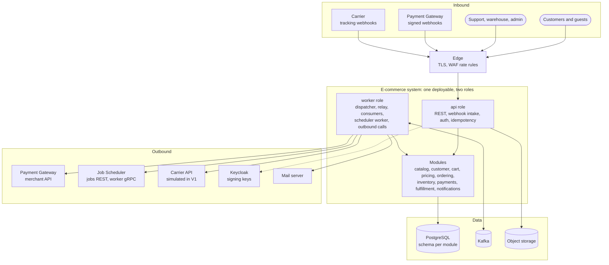
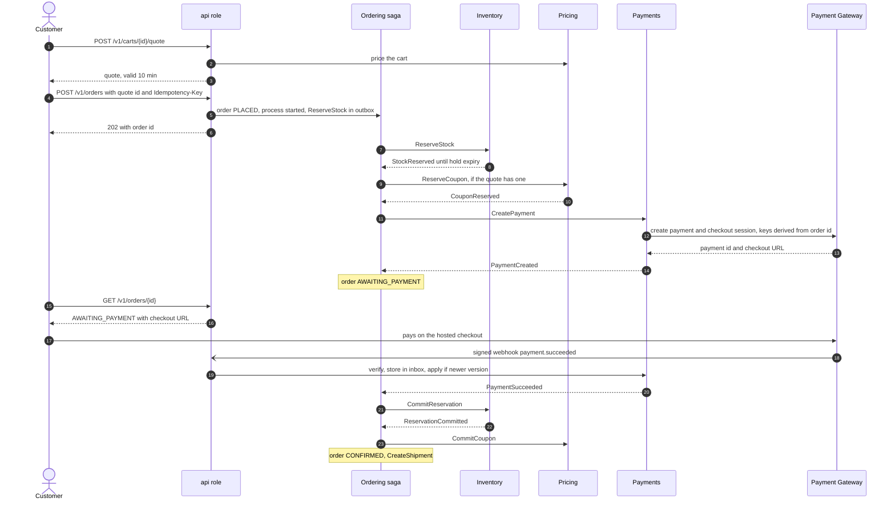
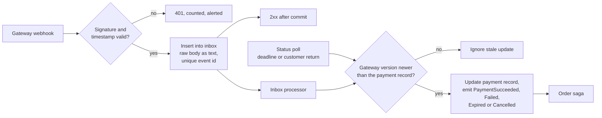
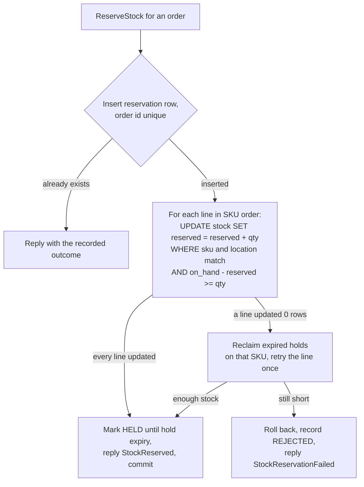
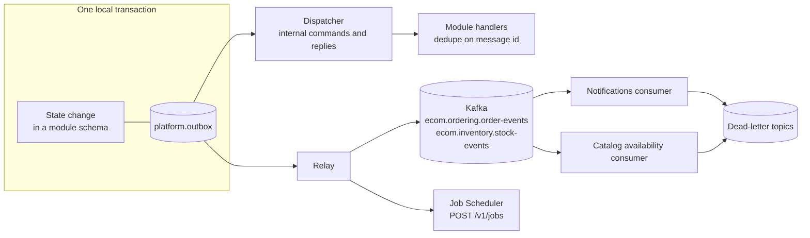
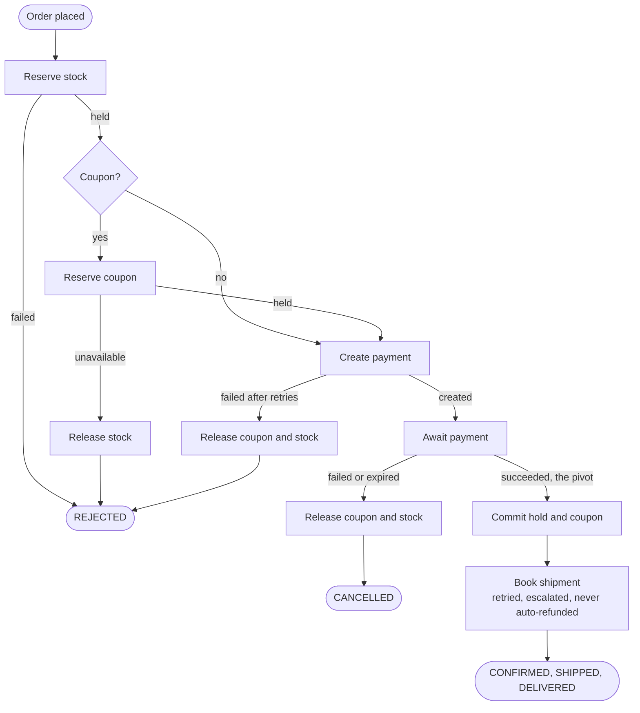
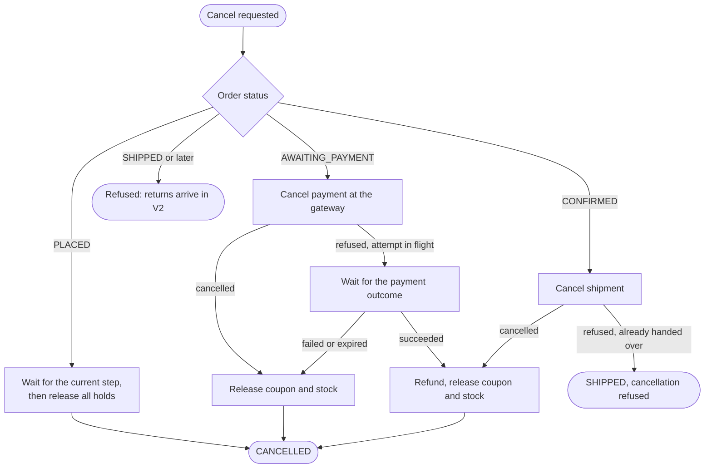
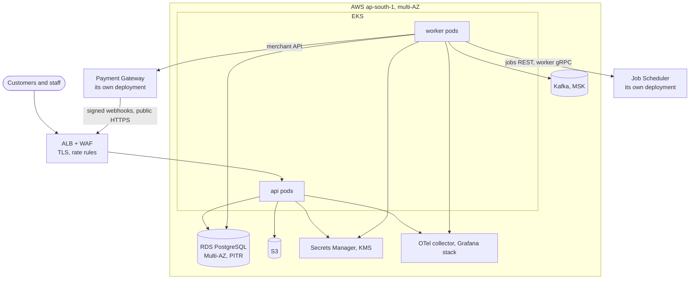

# Architecture (HLD)

| | |
|---|---|
| Phase | 2 — High-level design |
| Status | Approved 2026-10-02 |
| Inputs | [Requirements](requirements.md) (approved 2026-10-02) · [Domain model](domain-model.md) · [Order lifecycle](order-lifecycle.md) |
| Detail | [Consistency model](consistency-model.md) · [Failure handling](failure-handling.md) · [Event model](event-model.md) · [Decisions](decisions/README.md) · [Implementation plan](implementation-plan.md) |

## 1. Problem statement

A store sells scarce stock, is paid through a gateway it does not control, and ships through carriers it does not control. Any of them can be slow, fail, answer twice, answer late or answer out of order. The system must never oversell, never charge twice, never confirm an unpaid order and never leave an order stuck. Its checkout must also survive a flash sale.

## 2. Goals

| # | Goal |
|---|---|
| G1 | The five invariants (§14) hold under concurrency and partial failure |
| G2 | Every order reaches a terminal state; every wait has a deadline and an owner |
| G3 | Real integration with the Payment Gateway and the Job Scheduler, through their published contracts and without changing them |
| G4 | V1 modules can become services without redesign (V2, V3) |
| G5 | Any order can be followed end to end across the three systems |
| G6 | A flash sale (NFR-2) neither oversells nor times out |

## 3. Non-goals

A storefront UI; marketplace sellers; several warehouses; cash on delivery; customer returns (return to origin is in scope); a search engine; a cache tier; multi-region active-active; any claim of exactly-once delivery.

## 4. Functional requirements

See [requirements §5](requirements.md#5-functional-requirements). The flows that shape the architecture are placement and payment (FR-CHK, FR-PAY), reservation (FR-INV), cancellation before handover (FR-ORD4), fulfillment with out-of-order tracking (FR-FUL), and events and background work (FR-EVT).

## 5. Non-functional requirements

See [requirements §6](requirements.md#6-non-functional-requirements). The design points are 200 orders/s at peak, the flash sale, RPO 0, 99.9% checkout availability, and cloud environments created on demand.

## 6. Assumptions

| # | Assumption | If it proves wrong |
|---|---|---|
| A1 | One PostgreSQL primary carries NFR-1 (§16) | Read replicas for catalog and history, then time-partitioned outbox and history tables. Sharding only with evidence |
| A2 | The gateway's merchant contract is stable | Contract tests fail in CI before production does |
| A3 | Customers accept a few seconds of "payment processing" | Returning from the hosted checkout triggers an immediate status poll |
| A4 | The carrier is simulated in V1 | The carrier port stays narrow, so a real carrier replaces the simulator |
| A5 | Gateway webhooks normally arrive within seconds | Deadlines and polling bound the delay |

## 7. Constraints

- **Payment Gateway**, used unchanged ([ADR-002](decisions/ADR-002-payment-gateway-integration.md)): INR only; 100 writes/s and 200 reads/s per merchant per instance; webhooks only to public HTTPS addresses outside local runs; no cancellation while an attempt is processing; 30 minutes of grace for processing payments after expiry; late successes refunded automatically (`AUTO_REFUND`).
- **Job Scheduler**, used unchanged ([ADR-003](decisions/ADR-003-job-scheduler-integration.md)): jobs run only on gRPC workers; workers share one token; `LOW` and `NORMAL` submissions are shed under backlog; default tenant rate limit of 500 submissions/s.
- **This repository only** ([ADR-001](decisions/ADR-001-ecosystem-boundaries.md)): no changes to sibling projects.
- **Cost:** environments are created on demand and destroyed (NFR-11).

## 8. Domain boundaries

Nine contexts, four of them core ([domain-model.md](domain-model.md)). Each is a module with its own schema. Modules query each other read-only and change each other's state only through messages ([ADR-004](decisions/ADR-004-modular-monolith.md)).

## 9. High-level architecture

The gateway and the carrier appear twice: they call in through the edge (webhooks), and the worker calls out to them.

One deployable runs in two roles ([ADR-004](decisions/ADR-004-modular-monolith.md)):

- **api:** stateless HTTP. Authentication, idempotency keys, queries, the writes that start workflows, and webhook intake.
- **worker:** everything asynchronous. The outbox dispatcher and relay, Kafka consumers, the Job Scheduler worker, and calls to the gateway and carrier.

Locally, one process runs both roles. In the cloud they scale separately.

The alternatives were a service per context (nine deployables and a network hop on every step, for 200 orders/s) and a few services from day one. The latter is deferred to V3, once the message contracts have been proven in-process and over Kafka ([ADR-004](decisions/ADR-004-modular-monolith.md)).

## 10. Component architecture

| Component | Role | Responsibility |
|---|---|---|
| REST API | api | Public and staff endpoints described by OpenAPI; JWT validation; object-level authorization; `Idempotency-Key`; problem+json errors |
| Webhook intake | api | Gateway and carrier webhooks: verify the signature, store the raw body in an inbox, answer `2xx` only after commit |
| Modules | both | Domain logic per context ([domain-model.md](domain-model.md)) |
| Outbox dispatcher | worker | Delivers internal commands and replies to module handlers, in key order. In-process in V1, over Kafka from V2 |
| Outbox relay | worker | Publishes integration events to Kafka and submits Job Scheduler jobs |
| Kafka consumers | worker | Notifications; catalog availability hints |
| Scheduler worker | worker | gRPC session with the Job Scheduler; runs recurring sweeps and per-item tasks ([ADR-003](decisions/ADR-003-job-scheduler-integration.md)) |
| Gateway adapter | worker | Merchant API client with timeouts, circuit breaker, derived idempotency keys and `Retry-After` handling |
| Carrier adapter and simulator | worker | Booking and cancellation. In local and test profiles, the simulator sends tracking webhooks for scripted scenarios selected by the delivery PIN code, as the gateway's mock PSPs do by amount |

The message plumbing (outbox, dispatcher, relay, inbox, processed messages) lives in `platform` and is shared by all modules ([ADR-008](decisions/ADR-008-transactional-outbox.md)).

## 11. Data flow

### 11.1 Checkout

- The `202` returns before anything is reserved. The client follows `GET /v1/orders/{id}`. Whether placement waits up to 2 s for `AWAITING_PAYMENT`, to save the client a round trip, is decided in the phase 6 LLD.
- When the customer comes back from the hosted checkout, the API triggers one gateway status poll, so a slow webhook does not delay the confirmation.
- A payment is created only after the hold succeeds. Customers are never charged for stock that doesn't exist, and a flash sale creates at most as many payments as there are units.

### 11.2 Payment outcome

The raw body is stored as text, not `jsonb`: PostgreSQL normalizes `jsonb`, and a signed body must stay byte-exact to be re-verified. Webhooks and polls converge on the same version check, so neither can overwrite a newer state.

### 11.3 Inventory reservation

One local transaction covers every line, so an order holds all its stock or none. A losing transaction waits on the row lock and then re-checks its `WHERE` clause against the committed row, so two orders can never both take the last unit ([ADR-009](decisions/ADR-009-inventory-reservation.md)).

### 11.4 Fulfillment

`CreateShipment` → a booking task, one per shipment on the Job Scheduler, retried for up to 24 h → `BOOKED` → the warehouse marks it packed and handed over → order `SHIPPED`, reservation fulfilled → carrier tracking webhooks → `DELIVERED`. Alternatively, return to origin → restock and refund.

## 12. Event architecture

Three channels share one outbox ([ADR-008](decisions/ADR-008-transactional-outbox.md)):

| Channel | Carries | V1 transport | Later |
|---|---|---|---|
| Internal | Commands and replies between modules | In-process dispatcher | Kafka (V2) |
| Integration | Facts for other modules and systems | Kafka | Kafka |
| Tasks | Jobs for the Job Scheduler | Scheduler REST API | Same |

Topics, keys, the envelope, ordering and versioning are specified in [event-model.md](event-model.md).

## 13. Saga architecture

The order lifecycle is an **orchestrated saga**. One OrderProcess per order owns the workflow, sends commands, waits for replies and compensates ([ADR-007](decisions/ADR-007-saga-orchestration.md)). Side reactions, such as notifications and availability hints, are choreographed through Kafka events.

**The pivot is payment success.** Before it, every step can be compensated: release stock, release the coupon, cancel the gateway payment. After it, steps are retried until they succeed or a person intervenes. A carrier outage delays a paid order but never refunds it automatically, which is the correction to the brief's §30 example.

Cancellation is a separate branch that starts from whatever state the order is in:

**Compensation is not always possible**, so the design avoids needing it:

- A refund can fail (a closed account, for example). Support handles it, and it stays visible until resolved ([S18](failure-handling.md#s18-a-refund-fails)).
- Released stock may be sold within seconds, so a hold is released only once the payment can no longer succeed.
- A handed-over parcel cannot be recalled; that case becomes a return in V2.
- A sent notification cannot be unsent; a correction is sent instead.

## 14. Consistency model

| Invariant | Enforced by |
|---|---|
| No overselling | Inventory's conditional updates, all lines in one local transaction ([ADR-009](decisions/ADR-009-inventory-reservation.md)) |
| No double charge | One gateway payment per order, created with an `Idempotency-Key` derived from the order id; refunds keyed by order and reason ([ADR-010](decisions/ADR-010-idempotency.md)) |
| No unpaid confirmation | Only PaymentSucceeded (a verified webhook or a polled status) leads to `CONFIRMED` |
| No stuck order | A deadline on every waiting status, plus a recurring sweep and a daily reconciliation |
| Faithful record | Immutable snapshots copied from the quote at placement |

Strong consistency is limited to stock and coupon counters and to each aggregate (single-writer PostgreSQL rows). Everything that crosses a context (order vs. payment vs. shipment status, availability hints, notifications) is eventually consistent, with a named source of truth and a staleness bound. The full matrix is in [consistency-model.md](consistency-model.md).

## 15. Failure handling

| Mechanism | Covers |
|---|---|
| Outbox written in the state change's transaction | Broker, scheduler and process crashes: no lost and no phantom messages |
| Idempotent handlers, processed-messages table, webhook inbox | At-least-once delivery from every source |
| Gateway `Idempotency-Key` derived from the order | Timeouts with unknown outcome when creating, cancelling or refunding |
| Deadlines on every waiting status, swept every minute | Lost webhooks and replies; stuck orders |
| Versions and sequences (gateway `version`, envelope `sequence`, carrier timestamps) | Out-of-order delivery |
| Circuit breaker on the gateway | Fast failure at placement when payments are down |
| Retry policies on the scheduler; dead-letter topics on Kafka | Persistent failures become visible work items, not silent loss |

Every external dependency has a timeout:

| Dependency | Timeout | Retry | When it keeps failing |
|---|---|---|---|
| PostgreSQL | Statement 5 s; lock 2 s, 500 ms on stock rows | Deadlock and serialization errors retried 3 times | `503`; readiness fails |
| Payment Gateway | Connect 1 s, read 5 s | Outbox retries with the same key, honoring `Retry-After` | Circuit opens; placements fail fast; orders in flight are rejected after 60 s and their holds released |
| Job Scheduler REST | 2 s | Outbox retries | Tasks run late; invariants unaffected |
| Job Scheduler gRPC | 30 s long poll | Reconnect with backoff | The worker fences itself and registers again |
| Kafka producer | 30 s delivery timeout | Relay retries | Outbox rows wait; lag alert |
| Carrier API | 5 s | Scheduler retry policy, up to 24 h | Dead-lettered; support alerted |
| Keycloak signing keys | 2 s | Cached keys keep working | New keys unavailable: `401` for tokens signed with them |
| Mail server | 5 s | Notification retry sweep | Marked failed; alert |

The 20 scenarios, with detection, recovery, compensation, duplicates, customer impact and data risk for each, are in [failure-handling.md](failure-handling.md).

## 16. Scalability

### 16.1 Capacity at peak (NFR-1: 200 orders/s)

| Resource | Load | Plan |
|---|---|---|
| PostgreSQL | About 12 short transactions per order (2,400/s) and 15 outbox rows per order (3,000/s) | One primary in the 8-vCPU class, with batched relay updates. Read replica for catalog and history when reads demand it |
| Kafka | About 6 integration events per order (1,200 messages/s) | 12 partitions per topic; far below Kafka's limits |
| Payment Gateway | 2 writes per order (payment and checkout session): 400 writes/s | Above the default of 100 writes/s per instance: needs a per-merchant override (its admin API supports one) or at least 4 gateway instances. The relay honors `429` and `Retry-After` |
| Job Scheduler | One booking task per shipment (200/s); sweeps run a few times a minute | Under the 500/s tenant limit because deadlines are swept rather than scheduled per order ([ADR-003 amendment](decisions/ADR-003-job-scheduler-integration.md#amendment-2026-10-02-from-the-hld)) |
| api pods | About 7,000 requests/s: 5,000 catalog reads plus quotes, placements and status polls | Stateless on virtual threads; scale horizontally on CPU and p99 latency |
| worker pods | Dispatcher, relay and consumers | Lanes by key hash; Kafka partitions bound consumer parallelism |

### 16.2 Hotspots

| Hotspot | Risk | Handling |
|---|---|---|
| Stock row of a popular SKU | Row-lock queueing | Short transactions, conditional update, sold-out short-circuit, admission control. Striped stock rows only if load tests demand them ([ADR-009](decisions/ADR-009-inventory-reservation.md)) |
| Flash sale | About 1,700 attempts/s on one row | §16.3 |
| Gateway rate limit | `429` at peak | Per-merchant override. Payments are created only after a hold, so a sale creates at most as many payments as it has units |
| Database connections | Exhaustion in bursts | Separate bounded pools for api and worker; admission control in front of the pool, not inside it |
| Outbox relay | Lag at peak | Batched publishing; lanes by key hash; lag alert |
| Kafka partitions | A hot key | Keys are order ids and SKUs; a hot SKU produces one stock event per change, not per attempt |
| Product page during a sale | Read storm on one product | HTTP caching (`Cache-Control`, ETag) for anonymous product pages at the edge |

### 16.3 Flash sale (NFR-2)

**Load:** 100,000 users in 60 s is about 1,700 placement attempts per second on one SKU, plus product page reads.

**Without protection**, each conditional update holds the row lock for its whole transaction, 2–5 ms with a synchronous standby. One row then sustains about 200–500 reservations/s. The rest queue, connections run out and requests time out: NFR-2 fails, although nothing oversells.

**With protection:**

1. **Edge:** per-IP rate limits and bot checks.
2. **Waiting room for flash-sale SKUs:** placement requests get a ticket. Tickets are admitted at the rate the row sustains, and only while admitted holds are fewer than the remaining stock plus an abandonment margin. Others see "in line", then "sold out".
3. **Limits:** one unit per customer for flash-sale SKUs.
4. **Sold-out short-circuit:** once availability reaches 0, placements fail fast without touching the row. The flag clears when holds are released.
5. **Shorter payment window:** 5 minutes for flash-sale SKUs, so abandoned holds come back sooner.

The database remains the only gate for correctness; the waiting room only shapes the load. Its mechanism, a PostgreSQL ticket table or Redis, is chosen in phase 16 with load-test evidence.

### 16.4 Scaling path

Scale api and worker pods → add a read replica for catalog and order history → move internal channels to Kafka (V2) → extract Inventory (V3) so stock scales on its own → stripe hot stock rows or move to a single writer per SKU. Sharding orders is not on this path until evidence demands it.

## 17. Security

- **Authentication:** Keycloak issues OIDC tokens; the service validates them as a resource server, and the edge terminates TLS. Staff roles are customer, support, warehouse and admin.
- **Authorization:** every order, cart and address is checked against its owner. Order ids are UUIDv7 (74 random bits, unguessable). Order numbers are for display only. Guests reach their order through a signed, expiring link.
- **Webhooks:** gateway webhooks are verified by `PG-Signature` (HMAC-SHA256 over the timestamp and raw body, 5-minute tolerance, several secrets during rotation). Simulated carrier webhooks carry their own HMAC. Webhook routes skip end-user authentication; the signature is the authentication.
- **Secrets:** the merchant API key, webhook secrets and scheduler credentials come from the environment locally and Secrets Manager in AWS. They are never logged.
- **Personal data:** events carry ids, not names, addresses or emails. Consumers read contact details at use time, so anonymized data is never revived from old events. Personal data is masked in logs and encrypted at rest.
- **Abuse:** edge rate limits per IP; per-principal limits on writes; flash-sale admission control.
- **Audit:** staff actions and every money-moving action go to an append-only audit log with the actor.

The details come in `security.md` (phase 13).

## 18. Observability

- **Correlation:** logs carry `request_id`, `correlation_id` (the order id in order flows), `trace_id`, `event_id`, `payment_id`, `reservation_id` and `shipment_id`.
- **Traces (OpenTelemetry):** `traceparent` is sent on gateway calls and Kafka records. The Job Scheduler stores it with each job, so the execution span links back to the submitter. Gateway webhooks start new traces, which are correlated by order id and payment id.
- **Metrics** (brief §38):

  | Metric | Measures |
  |---|---|
  | `orders_placed_total`, `orders_confirmed_total` | Order throughput |
  | `orders_cancelled_total{reason}`, `orders_rejected_total{reason}` | Cancellations and rejections by reason |
  | `inventory_reservations_total{outcome}`, `inventory_reservation_duration_seconds` | Reservation success rate and latency |
  | `checkout_duration_seconds` | Placement until `AWAITING_PAYMENT` |
  | `payment_outcomes_total{outcome}` | Payment success rate |
  | `refunds_total{outcome}`, `shipment_bookings_total{outcome}` | Refund and booking outcomes |
  | `outbox_pending{destination}`, `outbox_oldest_age_seconds` | Outbox backlog |
  | `event_processing_duration_seconds` | Event handling latency |
  | Kafka consumer lag | Consumer backlog |
  | `orders_overdue` | Stuck orders |
  | `webhooks_rejected_total{reason}` | Rejected webhooks |

  Counter names avoid a `_created` suffix, which OpenMetrics reserves. Rare-event counters are registered at zero at startup so that `increase()` alerts see the first event (both lessons from Payment-Orchestrator).
- **Alerts:** overdue orders, outbox age, a non-empty dead-letter topic, consumer lag, a drop in payment success, a spike in reservation failures, rejected webhook signatures, failed refunds.
- **Dashboards** in Grafana; alert rules tested with `promtool`. The details come in `observability.md` (phase 12).

## 19. Deployment

**Locally,** `docker compose up` starts:

- the app, both roles in one process;
- PostgreSQL 17;
- Kafka (single-node KRaft);
- Keycloak;
- Mailpit;
- MinIO;
- Grafana LGTM.

The `ecosystem` profile adds the real Payment Gateway and Job Scheduler, built from their repositories, each with its own database and host ports.

**In AWS** ([ADR-014](decisions/ADR-014-deployment.md)):

The gateway's webhooks come in through the public ALB, because its SSRF guard refuses private addresses ([ADR-001](decisions/ADR-001-ecosystem-boundaries.md)). Rollouts are rolling deploys with expand/contract migrations. Health checks are split: liveness checks don't touch dependencies, readiness checks do. The details come in `deployment.md` (phase 17).

## 20. Alternatives considered

| Decision | Chosen | Alternatives | ADR |
|---|---|---|---|
| Architecture | Modular monolith with api and worker roles | A few services now; a service per context | [ADR-004](decisions/ADR-004-modular-monolith.md) |
| Database and data access | PostgreSQL 17, schema per module, Spring Data JDBC and JdbcClient | MySQL; distributed SQL; JPA; jOOQ | [ADR-005](decisions/ADR-005-postgresql.md) |
| Broker | Kafka | RabbitMQ; SNS and SQS; Redis Streams; PostgreSQL only | [ADR-006](decisions/ADR-006-kafka.md) |
| Coordination | Orchestrated saga | 2PC/XA; choreography | [ADR-007](decisions/ADR-007-saga-orchestration.md) |
| Publishing | Polling transactional outbox | Dual writes; CDC with Debezium; Spring Modulith's publication registry | [ADR-008](decisions/ADR-008-transactional-outbox.md) |
| Stock | Conditional updates and reservation records | Optimistic retries; `SELECT … FOR UPDATE`; distributed locks; Redis counters; a single writer per SKU | [ADR-009](decisions/ADR-009-inventory-reservation.md) |
| Idempotency | Layered: API, domain, messages, outbound | API keys only | [ADR-010](decisions/ADR-010-idempotency.md) |
| Event contracts | JSON Schema in the repository, versioned event types | Avro or Protobuf with a schema registry | [ADR-011](decisions/ADR-011-event-versioning.md) |
| Caching | None in V1 | Redis; local caches | [ADR-012](decisions/ADR-012-no-cache-v1.md) |
| Stack | Java 25, Spring Boot 4.1 | Kotlin; Go; TypeScript with NestJS | [ADR-013](decisions/ADR-013-technology-stack.md) |
| Deployment | AWS ap-south-1, EKS, Terraform | ECS; App Runner; VMs | [ADR-014](decisions/ADR-014-deployment.md) |

## 21. Trade-offs

- **An asynchronous saga from day one** costs a few hundred milliseconds per checkout and a dispatcher, compared with one local transaction. In exchange, failure handling is real from V1, and extraction (V3) changes the transport, not the logic.
- **A single PostgreSQL primary** keeps strong consistency simple. Its limits, the write ceiling and hot rows, are handled by admission control and later extraction, not by premature sharding.
- **Kafka** is heavier than V1's volume strictly needs. It is justified by fan-out and replay for consumers, and by the learning goal, which ADR-006 states openly.
- **Checkout depends on the gateway.** Without it there are no new prepaid orders, by design (NFR-8).
- **Holds can last up to 50 minutes** for payments stuck in processing. That is the price of never refunding a customer whose payment succeeded within the gateway's rules.
- **Backstops fire up to a minute late**, because deadlines are swept rather than scheduled per order.
