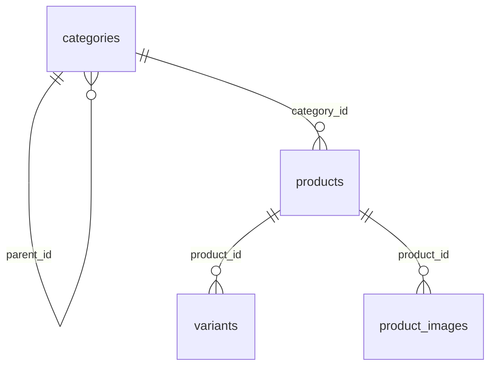
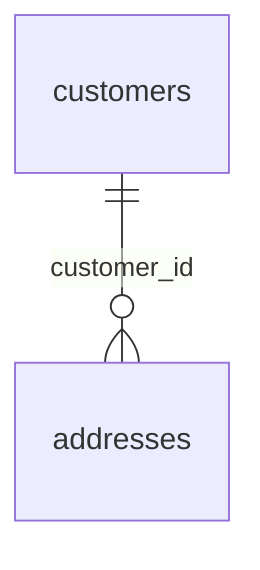

# Database

| | |
|---|---|
| Status | Grows with each module's schema. Phase 2 (platform) and phase 3 (catalog, customer) |
| Decisions | [ADR-005](decisions/ADR-005-postgresql.md) (PostgreSQL, a schema per module), [ADR-008](decisions/ADR-008-transactional-outbox.md) (outbox), [ADR-010](decisions/ADR-010-idempotency.md) (idempotency) |

## 1. Conventions

- **One schema per module,** owned by that module alone, with its own Flyway history (`db/migration/<module>/`). Foreign keys and joins never cross schemas.
- **Ids:** UUIDv7 (`Ids.newId()`), except the outbox's identity column. `bigint` for counters and versions.
- **Money:** `bigint` paise. **Time:** `timestamptz`, written with microsecond precision.
- **JSON:** `jsonb` for structured data that is queried or validated, `text` for payloads that must stay byte-exact, such as message envelopes.
- **Status columns** are `text` with a `CHECK` listing the allowed values.
- **Changes during a deployment** are expand/contract: add, backfill, switch, then drop in a later release.
- **Personal data** (names, emails, phones, addresses) lives only in the `customer` schema.

## 2. `platform` (phase 2)

| Table | Purpose | Key columns | Retention |
|---|---|---|---|
| `outbox` | One row per message and destination ([LLD §2.2](low-level-design.md#22-publishing)) | `id` identity; `message_id` + `destination` unique; `aggregate_type`, `aggregate_id`, `sequence` order delivery; `delivered_at` / `parked_at` | Delivered rows: 7 days |
| `processed_messages` | Which consumer handled which message | Primary key `consumer` + `message_id` | 30 days |
| `scheduled_tasks` | The in-process task scheduler ([LLD §2.7](low-level-design.md#27-tasks)) | `dedupe_key` unique while pending or running; `status`, `run_at`, `lease_until`, `attempts` | Finished tasks: 30 days |
| `idempotency_keys` | API idempotency ([LLD §2.8](low-level-design.md#28-api-idempotency-keys)) | Primary key `scope` + `key`; `fingerprint`; stored response | Until `expires_at` (24 h) |
| `audit_log` | Append-only record of staff and money actions | Actor, action, target, `details` (`jsonb`); a trigger rejects `UPDATE` and `DELETE` | Kept; monthly partitions later |

Indexes worth knowing:

| Index | Serves |
|---|---|
| `outbox_pending (next_attempt_at, id)` partial on pending rows | Claiming due rows |
| `outbox_pending_by_aggregate (destination, aggregate_type, aggregate_id, sequence, id)` partial on undelivered rows | The eligibility rule |
| `scheduled_tasks_active_dedupe (dedupe_key)` unique, partial on pending and running | Task deduplication |

## 3. `catalog` (phase 3)

| Table | Columns | Constraints and indexes |
|---|---|---|
| `categories` | `id`, `parent_id`, `name`, `slug`, `created_at`, `updated_at` | `slug` unique; `parent_id` references `categories` |
| `products` | `id`, `category_id`, `title`, `description`, `gst_category`, `options` (`jsonb`: `[{name, values[]}]`), `status`, `version`, `search_vector`, `created_at`, `updated_at` | `search_vector` generated from title (weight A) and description (weight B), GIN index; `(category_id, id)` partial on `ACTIVE`; `(status, id)` |
| `variants` | `id`, `product_id`, `sku`, `option_values` (`jsonb`: `{name: value}`), `combination_key`, `price_paise`, `status`, `created_at`, `updated_at` | `sku` unique; `(product_id, combination_key)` unique; `price_paise` between 1 and 1,000,000,000 |
| `product_images` | `id`, `product_id`, `object_key`, `content_type`, `size_bytes`, `alt_text`, `status`, `position`, `created_at`, `completed_at` | `object_key` unique; `(product_id, position)`; `created_at` partial on `PENDING`, for expiry |

- `combination_key` is the canonical form of a variant's option values (`color=red;size=m`), so the unique index enforces one variant per combination.
- `version` increases with every change to the product, its variants or its images. It is the admin `ETag`.

## 4. `customer` (phase 3)

| Table | Columns | Constraints and indexes |
|---|---|---|
| `customers` | `id`, `subject` (the identity provider's user id), `email`, `name`, `phone`, `created_at`, `updated_at` | `subject` unique |
| `addresses` | `id`, `customer_id`, `recipient_name`, `phone`, `line1`, `line2`, `landmark`, `city`, `state_code` (GST state code), `pin_code`, `is_default`, `created_at`, `updated_at` | `(customer_id)` unique where `is_default`; `pin_code` checked (`^[1-9][0-9]{5}$`); `(customer_id, created_at)` |

Account deletion (phase 13) anonymizes these rows instead of deleting them where orders still refer to the customer.
