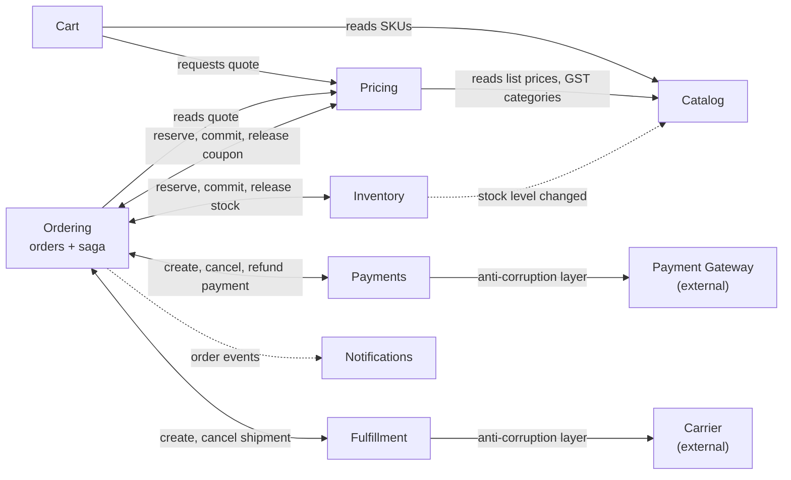

# Domain model

| | |
|---|---|
| Phase | 2 — Domain modeling |
| Status | Approved 2026-10-02 |
| Related | [Requirements](requirements.md) · [Order lifecycle](order-lifecycle.md) · [Architecture](architecture.md) · [Event model](event-model.md) |

## 1. Bounded contexts

Nine contexts. Each is a module of the V1 monolith with its own database schema ([ADR-004](decisions/ADR-004-modular-monolith.md)). The four core contexts hold the invariants that money and stock depend on.

| Context | Kind | Owns | Source of truth for |
|---|---|---|---|
| **Ordering** | Core | Orders and the order process (saga) | What was bought, at what price, and the order's status |
| **Inventory** | Core | Stock per SKU and location; reservations | Sellable stock |
| **Payments** | Core, thin | One payment record per order, its refunds, the gateway webhook inbox | This system's view of each payment. The gateway remains the truth for money |
| **Fulfillment** | Core | Shipments, carrier bookings, tracking | Where each parcel is |
| **Pricing** | Supporting | Quotes, GST rules, shipping fees, coupons and their redemptions | The price an order is placed at; coupon usage |
| **Catalog** | Supporting | Products, variants (SKUs), categories, media, list prices, availability hints | What can be sold, at what list price |
| **Cart** | Supporting | Carts | What a shopper intends to buy |
| **Customer** | Generic | Profiles and addresses | Contact details and addresses. Identity stays in the identity provider |
| **Notifications** | Generic | Notification log | What was sent to whom |

`platform` is shared infrastructure, not a context: outbox, inbox, processed messages, idempotency keys, task scheduling and the audit log.

Why this split:

- **Pricing is separate from Cart and Ordering.** It owns rules that change on their own schedule (GST, shipping fees, coupons) and a reservable resource (coupon redemptions). Cart only holds intent; Ordering only copies the result.
- **Payments is thin.** The gateway already orchestrates PSPs, routes, retries and reconciles. Payments is an anti-corruption layer: it translates the gateway's model into this system's events and keeps the record an order needs.
- **Cart is not part of Ordering.** Carts are high-churn and mostly abandoned; orders are durable records with legal weight. They share nothing but SKU ids.

### Context map

Solid arrows are queries or commands; dotted arrows are events. Queries between modules are synchronous and read-only. Every state change in another module goes through a command or an event ([ADR-004](decisions/ADR-004-modular-monolith.md)).

## 2. Aggregates and invariants

### Ordering

**Order** (aggregate root)

- Holds: id (UUIDv7), order number (for display only, never used for access), customer (customer id, or guest email and phone), lines, delivery and billing address snapshots, coupon snapshot, totals, status, cancellation request (who, why, when), and references to its payment and shipment.
- Each line is a snapshot: SKU, product title, variant options (size, color), image, quantity, unit price, discount share, taxable value, GST rate, CGST, SGST and IGST amounts, line total.
- Invariants:
  - Lines, prices, taxes and addresses never change after placement.
  - Grand total = Σ line totals + shipping fee + tax on shipping, in paise.
  - Status changes only along the state machine in [order-lifecycle.md](order-lifecycle.md).
  - One order per quote.
- Concurrency: each transition locks the order's row and is one transaction ([LLD §6.4](low-level-design.md#64-orders)).

**OrderProcess** (aggregate root; the saga for one order)

- Holds: current step, outstanding commands, a cancellation-requested flag, deadline, attempt counters, compensation progress.
- Invariants: at most one outstanding command per participant; every waiting step has a deadline.
- Kept apart from Order so that coordination details (retries, deadlines, outstanding commands) never leak into the status customers see.

### Inventory

**StockItem** (aggregate root, per SKU and location)

- `on_hand`: sellable units in the warehouse. `reserved`: units held for orders not yet handed to a carrier. `available = on_hand − reserved`.
- Invariant: `0 ≤ reserved ≤ on_hand`.
- Concurrency: atomic conditional update (`… WHERE on_hand - reserved >= :qty`), never read-modify-write ([ADR-009](decisions/ADR-009-inventory-reservation.md)).
- Every change to `on_hand` writes a stock movement (receipt, adjustment, handover, return), and `on_hand` equals their sum ([ADR-021](decisions/ADR-021-stock-movements.md)).

**Reservation** (aggregate root, one per order)

- Holds: order id (unique), lines (SKU, location, quantity), status, `expires_at`.
- Status: `HELD` → `COMMITTED` → `FULFILLED` → `RETURNED` (after a return to origin); or `RELEASED`, `EXPIRED`; or `REJECTED` (nothing was held). Committing an `EXPIRED` reservation takes its stock again if it can ([LLD §5.5](low-level-design.md#55-commit-release-handover-and-returns)).
- Invariants:
  - It covers every line of its order, or none of them (`REJECTED`).
  - Its quantities count in `reserved` exactly while it is `HELD` or `COMMITTED`.

The brief suggests `Available = Total − Reserved − Sold`. Here "sold" is a reservation status rather than a counter: committed units stay in `reserved` until handover, when `on_hand` and `reserved` both drop. Two counters are enough, and every held unit is accounted for by exactly one reservation.

Placing a reservation updates each StockItem it touches in one local transaction, in SKU order to avoid deadlocks. This is the one place a transaction spans several aggregates, on purpose: all-or-nothing per order (FR-INV2) is far simpler here than a saga across SKUs. It is revisited if stock is ever partitioned ([ADR-009](decisions/ADR-009-inventory-reservation.md)).

### Pricing

**Quote** (aggregate root)

- Holds: priced lines (unit price, discount share, taxable value, GST rate and amounts), shipping fee and its tax, totals, coupon, delivery state, `valid_until` (10 minutes).
- Invariants: immutable; totals are exactly the sum of their parts, in paise.

**Coupon** (aggregate root)

- Holds: code, rule (percentage or flat, cap, minimum order value), validity window, redemption limit, per-customer limit, and counters `reserved` and `redeemed`.
- Invariant: `reserved + redeemed ≤ limit`, kept by the same conditional update as stock.

**CouponRedemption** (one per order): `HELD` → `COMMITTED`, or `RELEASED`. It mirrors Reservation.

### Payments

**PaymentRecord** (aggregate root, one per order in V1)

- Holds: order id (unique), gateway payment id (unique), amount, status mirrored from the gateway, last applied gateway `version`, and refunds (gateway refund id, amount, status, initiated by this system or by the gateway's late-success policy).
- Invariants: status only moves to a newer gateway version; Σ non-failed refunds ≤ captured amount.

### Fulfillment

**Shipment** (aggregate root, one per order in V1)

- Holds: order id (unique), lines, carrier, AWB, status, tracking history, booking attempts.
- Invariants: status changes follow the shipment state machine ([order-lifecycle.md §4](order-lifecycle.md#4-related-state-machines)) and only for newer carrier events; cancellation only before handover.

### Catalog, Cart, Customer, Notifications

| Aggregate | Holds | Invariants |
|---|---|---|
| **Product** with its **Variants** | Option dimensions (size, color); one variant (SKU) per combination; list price in paise; GST category; status `DRAFT`, `ACTIVE` or `ARCHIVED`; availability hint per variant | SKU code unique; an active product has at least one active, priced variant |
| **Category** | Name, parent | No cycles |
| **Cart** | Owner (customer id or guest token), lines, coupon code, status `ACTIVE`, `MERGED`, `CHECKED_OUT` or `EXPIRED`, last activity | 1–10 units per line (flash-sale SKUs may cap lower); at most 50 lines; one coupon |
| **Customer** | Identity-provider subject (unique), name, email, phone, up to 10 addresses with one default | Addresses have a valid PIN code and state |
| **Notification** | Deduplication key (order id + kind, unique), channel, status, attempts | Sent at most once per key |

## 3. Commands and events by context

| Context | Commands it handles | Events it emits |
|---|---|---|
| Ordering | PlaceOrder, CancelOrder | OrderPlaced, OrderConfirmed, OrderCancelled, OrderRejected, OrderShipped, OrderDelivered, OrderDeliveryFailed, OrderReturnedToOrigin |
| Inventory | ReserveStock, CommitReservation, ReleaseReservation, FulfillReservation, RestockReturn, ReceiveStock, AdjustStock | StockReserved, StockReservationFailed, ReservationCommitted, ReservationLost, StockLevelChanged |
| Pricing | CreateQuote, ReserveCoupon, CommitCoupon, ReleaseCoupon | CouponReserved, CouponUnavailable |
| Payments | CreatePayment, CancelPayment, CheckPayment, RefundPayment | PaymentCreated, PaymentCreationFailed, PaymentSucceeded, PaymentFailed, PaymentExpired, PaymentCancelled, PaymentCancelRefused, PaymentPending, RefundInitiated, RefundSucceeded, RefundFailed |
| Fulfillment | CreateShipment, CancelShipment, MarkPacked, MarkHandedOver | ShipmentBooked, ShipmentBookingFailed, ShipmentCancelled, ShipmentCancelRefused, ShipmentHandedOver, ShipmentDelivered, ShipmentReturnInitiated, ShipmentReturnedToOrigin |
| Catalog | Product and price management | None published in V1; a product event stream arrives with its first consumer |
| Cart, Customer | Their own create, update and delete operations | None: nothing consumes them |

Which of these are commands, replies, domain events or integration events, and how each one travels, is defined in [event-model.md](event-model.md).

## 4. Domain terms

These complement the [requirements glossary](requirements.md#10-glossary).

| Term | Meaning |
|---|---|
| Placement | Accepting an order from a valid quote. Stock is not yet reserved |
| On hand / reserved / available | Units in the warehouse / units held for orders / the difference |
| Hold | A `HELD` reservation: stock set aside while the customer pays |
| Commit | Payment succeeded: the hold stays until handover |
| Handover | The parcel leaves with the carrier: its units leave `on_hand` and `reserved` |
| Hold expiry | Payment window + the gateway's grace for processing payments + a margin ([ADR-009](decisions/ADR-009-inventory-reservation.md)) |
| Pivot | Payment success. Before it, failed steps are undone; after it, they are retried |
