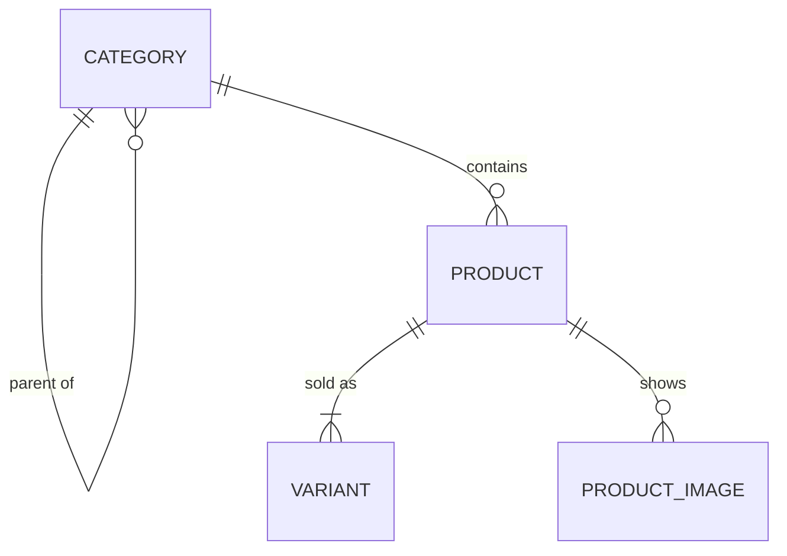
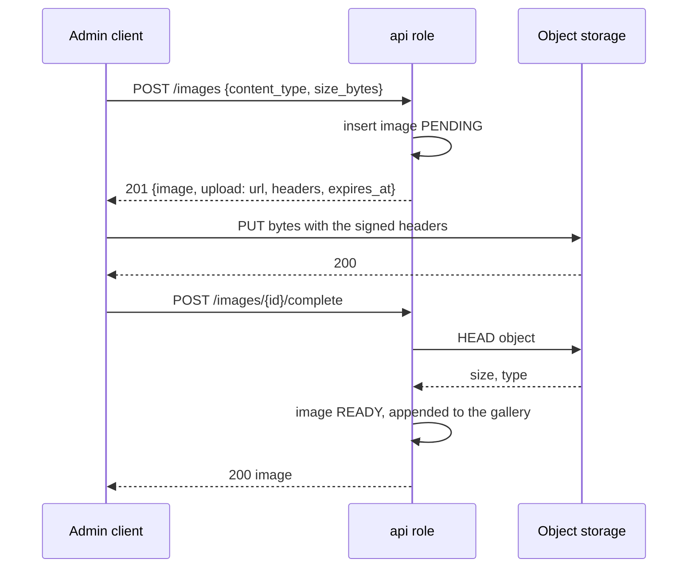
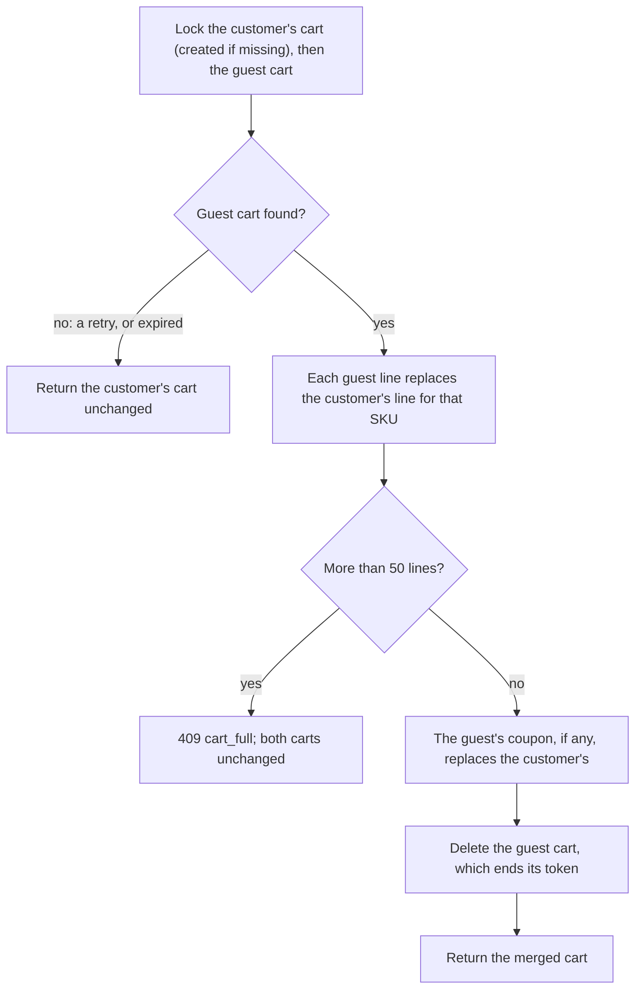
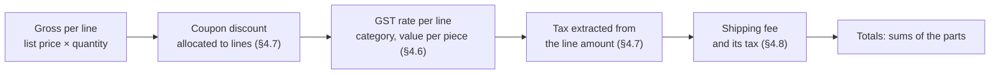
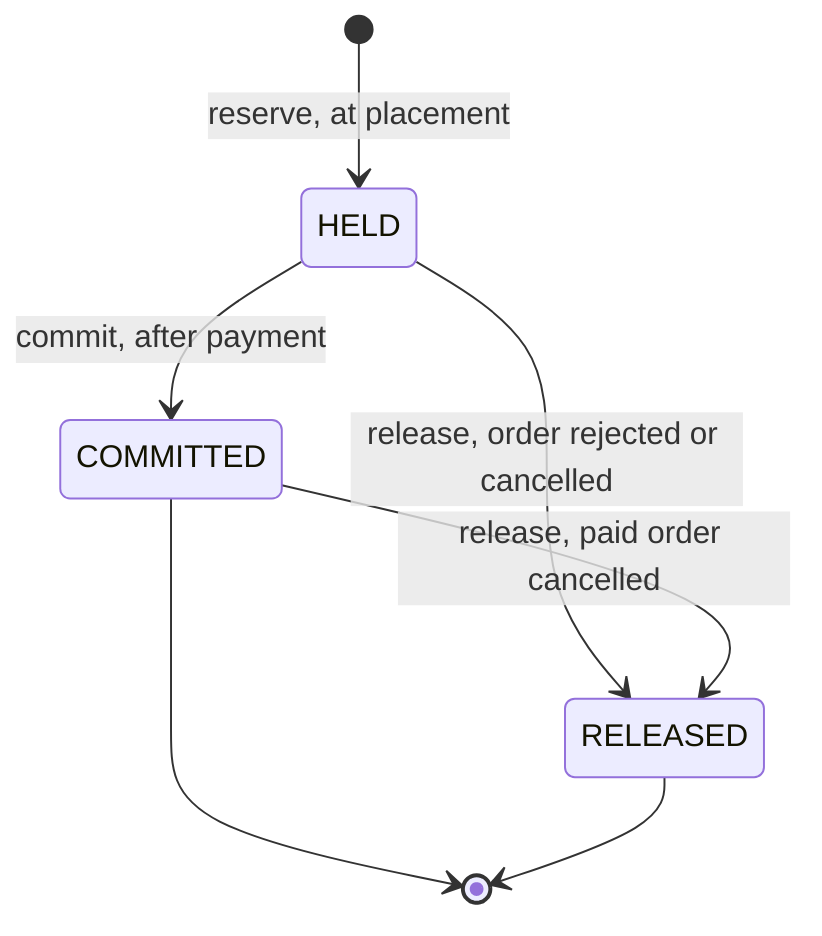
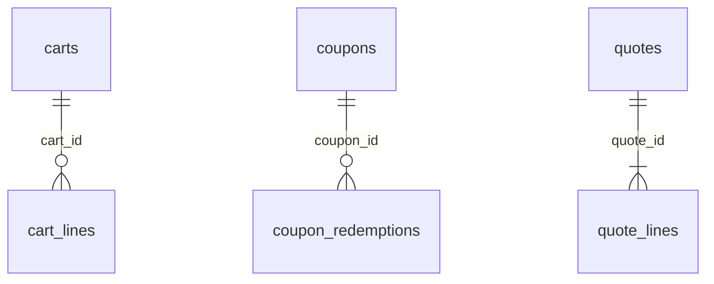
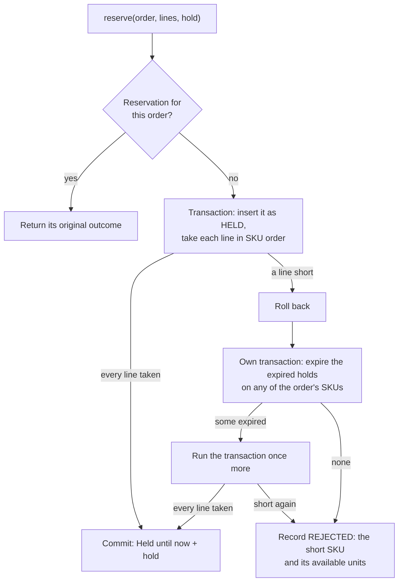
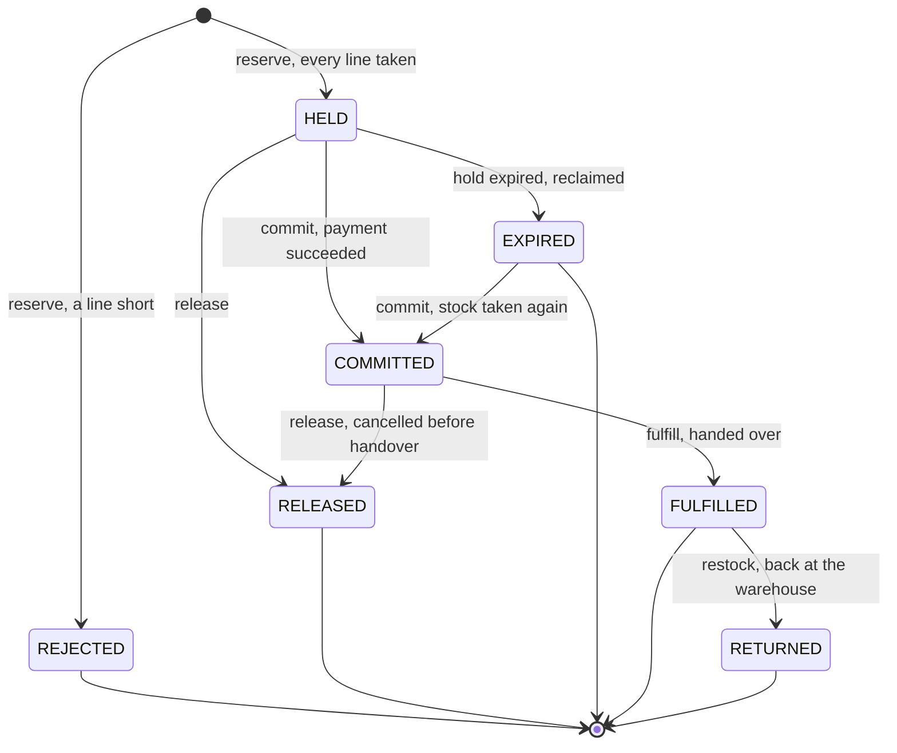
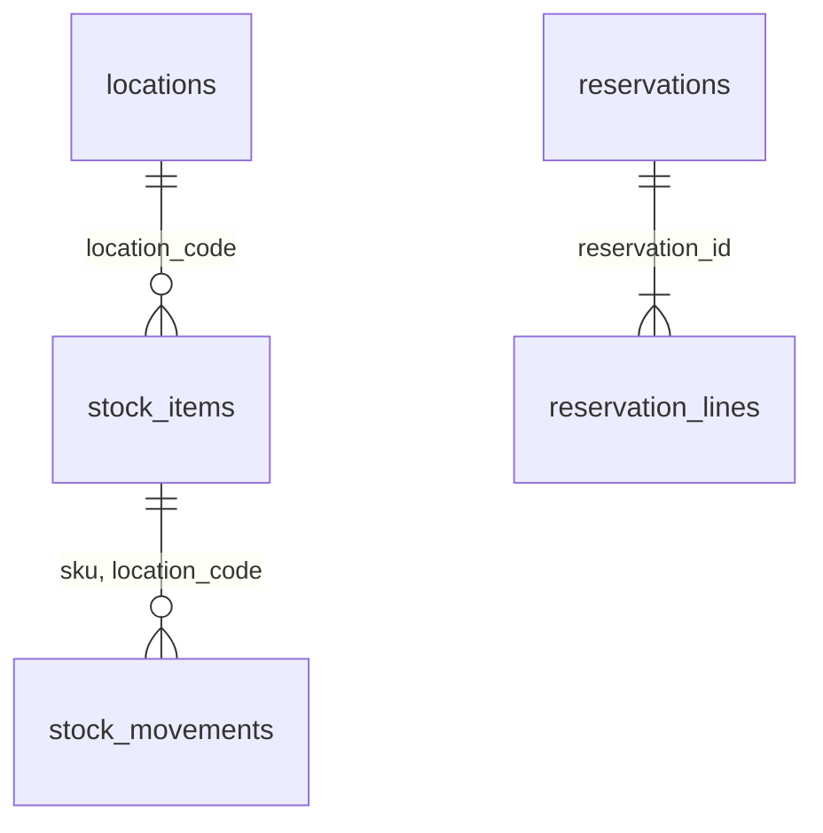

# Low-level design

| | |
|---|---|
| Status | Grows one section per phase. Each section is written before its phase's code ([implementation plan](implementation-plan.md)) |
| Inputs | [Architecture](architecture.md) · [Domain model](domain-model.md) · [Decisions](decisions/README.md) |

## 1. Scaffolding (phase 1)

### 1.1 Repository layout

```
build.gradle.kts, settings.gradle.kts, gradlew, gradle/wrapper/
Dockerfile, docker-compose.yml, .github/workflows/ci.yml
src/main/java/com/ecommerce/
  EcommerceApplication.java
  shared/          value types every module may use (open module)
  platform/        roles, HTTP conventions, migrations; later the outbox, inbox, idempotency, tasks, audit
  catalog/ customer/ cart/ pricing/ ordering/ inventory/ payments/ fulfillment/ notifications/
src/main/resources/
  application.yml, application-local.yml
  db/migration/<module>/V<n>__<description>.sql
src/test/java/com/ecommerce/
  LocalDevApplication.java   local run on embedded PostgreSQL
  architecture/              module and coding rules
  platform/                  roles, HTTP conventions, migrations
  support/                   embedded PostgreSQL
docs/
```

### 1.2 Modules and their boundaries

- The main class lives in `com.ecommerce`; each direct sub-package is a Spring Modulith module ([ADR-004](decisions/ADR-004-modular-monolith.md)).
- A module's **base package is its API**: the types other modules may use (module query interfaces, commands, replies, events, annotations). **Sub-packages are internal** (`domain`, `infrastructure`, `web`, …). Spring Modulith rejects any access to another module's internal types.
- Allowed dependencies are declared in each module's `package-info.java` and verified at build time:

| Module | May depend on |
|---|---|
| `shared` | Nothing (open module: all its types are API) |
| `platform` | `shared` |
| `catalog`, `customer`, `inventory`, `payments`, `fulfillment` | `platform`, `shared` |
| `pricing` | `catalog`, `platform`, `shared` |
| `cart` | `catalog`, `customer` (from phase 4, [§4.2](#42-module-boundaries)), `pricing`, `platform`, `shared` |
| `ordering` | `pricing`, `customer`, `inventory`, `payments`, `fulfillment`, `platform`, `shared` |
| `notifications` | `ordering`, `customer`, `platform`, `shared` |

Dependencies point from the saga to its participants: Ordering knows the commands and replies that Inventory, Payments and Fulfillment publish in their APIs; the participants never know Ordering. Kafka integration events cross modules as JSON contracts, not Java types, so the availability hints from Inventory to Catalog create no compile-time dependency.

### 1.3 Roles

- `ecom.roles` (environment `ECOM_ROLES`): a comma-separated subset of `api` and `worker`. Default: both. An empty value fails startup.
- `@ApiController` = `@RestController` + `@ConditionalOnRole(API)`. Every public controller uses it; an architecture test rejects a bare `@RestController` in a module.
- `@WorkerComponent` = `@Component` + `@ConditionalOnRole(WORKER)`, for background work from phase 2.
- Every instance runs the management server on port 8081 (health, info). Port 8080 serves the public API only where the `api` role is active; a worker-only instance answers 404 there.
- `/actuator/info` reports the active roles.

### 1.4 Configuration

| Profile | Use |
|---|---|
| (default) | Containers and the cloud: everything from environment variables |
| `local` | A developer machine: plain logs, debug logging for `com.ecommerce` |
| `test` | Tests |

| Variable | Default | Meaning |
|---|---|---|
| `DB_URL` | `jdbc:postgresql://localhost:5432/ecommerce` | JDBC URL |
| `DB_USER`, `DB_PASSWORD` | `ecommerce`, empty | Credentials |
| `DB_POOL_SIZE` | 20 | Hikari pool size |
| `ECOM_ROLES` | `api,worker` | Roles of this instance |
| `PORT`, `MANAGEMENT_PORT` | 8080, 8081 | HTTP ports |
| `LOGGING_STRUCTURED_FORMAT_CONSOLE` | unset; `ecs` in the image | JSON logs |

Typed properties (`@ConfigurationProperties`, validated) fail startup on invalid values rather than at first use.

### 1.5 HTTP conventions

- JSON in `snake_case`; null fields omitted; timestamps in ISO-8601 UTC.
- **Request ids.** An incoming `X-Request-Id` is kept if it matches `[A-Za-z0-9._-]{1,64}`; otherwise a `req_<32 hex>` id is generated. It is echoed on every response and put in the logging context (MDC) as `request_id`.
- **Errors** are RFC 9457 problem details (`application/problem+json`) with two extensions: `code`, stable and documented, and `request_id`. Validation errors add `errors: [{field, message}]`. A `500` never carries an exception message.

| Code | Status | When |
|---|---|---|
| `invalid_request` | 400 | Missing or mistyped parameter or header |
| `malformed_request` | 400 | Unreadable body |
| `validation_failed` | 400 | Constraint violations; `errors` lists the fields |
| `not_found` | 404 | No such resource or route |
| `method_not_allowed` | 405 | Wrong method |
| `not_acceptable` | 406 | No acceptable representation |
| `unsupported_media_type` | 415 | Wrong content type |
| `internal_error` | 500 | Anything unexpected, logged with its request id |

Modules raise `ApiException` (status, code, detail) for their own errors; the codes are listed in `api.md` as they appear.

- Virtual threads; graceful shutdown (Spring Boot's 30-second default).

### 1.6 Database and migrations

- One database; one schema per module; one application role in V1 ([ADR-005](decisions/ADR-005-postgresql.md)).
- **Each module has its own Flyway history.** Its migrations live under `db/migration/<module>/`, and its history table is `<module>.flyway_schema_history`, so the history moves with the module at extraction.
- A `FlywayMigrationStrategy` runs Spring Boot's Flyway configuration once per module, `platform` first, then the business modules. Spring Boot still orders database initialization before anything uses the database.
- Each module's first migration, `V1__schema_owner.sql`, records its owner on the schema (`COMMENT ON SCHEMA`). Every module therefore owns a schema and a history from phase 1, before it has tables.
- Rules: forward-only; expand/contract when a running version depends on the old shape; versions per module start at V1.

### 1.7 Health

| Probe | Includes | Paths |
|---|---|---|
| Liveness | `livenessState` only: never a dependency | `:8081/actuator/health/liveness`, `:8080/livez` |
| Readiness | `readinessState`, `db` | `:8081/actuator/health/readiness`, `:8080/readyz` |

### 1.8 Logging

- In containers, structured JSON (Elastic Common Schema), enabled by `LOGGING_STRUCTURED_FORMAT_CONSOLE=ecs` in the image. MDC fields such as `request_id` become JSON fields.
- Locally, plain text with the request id after the level.
- No `System.out`, no `java.util.logging` (architecture test). Personal data is masked from phase 13.

### 1.9 Local runs

- `./gradlew bootTestRun`: embedded PostgreSQL (data kept in `.embedded-pg/`, port 55433), `local` profile, both roles. No Docker needed.
- `docker compose up --build`: PostgreSQL 17 (host port 5433) and the app (8080, 8081).
- **Change from the plan:** each later phase adds the containers it needs (Keycloak and MinIO in phase 3, the gateway in phase 7, Kafka and Mailpit in phase 9, the scheduler in phase 10, Grafana LGTM in phase 12), so `docker compose up` starts only what the code uses.

### 1.10 Container image

Two stages: JDK 25 to build, JRE 25 to run. The jar is extracted in layers (dependencies, loader, application) so code changes rebuild only the top layer. Non-root user; `-XX:MaxRAMPercentage=75 -XX:+ExitOnOutOfMemoryError`; JSON logs.

### 1.11 Continuous integration (GitHub Actions)

- **build:** Temurin JDK 25, Gradle, `./gradlew build`: compile with `-Werror`, then all tests. Test reports are uploaded on failure.
- **container:** after build. Builds the image, starts `docker compose`, waits for readiness on port 8081, checks the roles reported by the info endpoint, and checks that an unknown route answers with a `not_found` problem.

### 1.12 Tests

| Test | Proves |
|---|---|
| `ModularityTests` | Spring Modulith detects all eleven modules and accepts their allowed dependencies |
| `ModuleBoundaryEnforcementTests` | A fixture (root marked `@Modulithic`) with a forbidden dependency is reported, so the check really can fail the build |
| `ArchitectureTests` | Coding rules: no field injection, no standard streams, no `java.util.logging`, no generic exceptions, public controllers use `@ApiController`. Module layering is Spring Modulith's job |
| `ApiRoleTests`, `WorkerRoleTests`, `BothRolesTests` | The app starts on embedded PostgreSQL in each role. Info reports the roles; liveness and readiness are up on both ports; the public API is served only in the `api` role |
| `ModuleMigrationsTests` | Every module has its schema, its own history with V1 applied and its owner comment; every migration folder belongs to a registered module |
| `RolePropertiesTests` | `ecom.roles` binds case-insensitively; an empty or unknown role fails startup |
| `ProblemDetailsTests` | The error model for 400 (malformed and validation), 404, 405, 409 (module error), 415 and 500, and request id propagation |

### 1.13 Exit criteria

| Criterion | Shown by |
|---|---|
| `./gradlew build` green in CI | The build job |
| The app starts in both roles | The role tests; the compose smoke test in CI |
| A forbidden module dependency fails the build | `ModuleBoundaryEnforcementTests` and `ModularityTests`. Checked by hand once: a catalog class using an inventory-internal type failed the build with "Module 'catalog' depends on module 'inventory' … Allowed targets: platform, shared" |

## 2. Platform: messages, tasks, idempotency, audit (phase 2)

### 2.1 Scope

Phase 2 builds the machinery every later phase relies on ([ADR-008](decisions/ADR-008-transactional-outbox.md), [ADR-010](decisions/ADR-010-idempotency.md), [ADR-003](decisions/ADR-003-job-scheduler-integration.md)):

- **Messages:** the outbox, the in-process dispatcher, the Kafka relay, deduplication of processed messages, and LISTEN/NOTIFY wake-ups.
- **Tasks:** the `TaskScheduler` port with its in-process adapter, including recurring tasks.
- **API idempotency keys** and the **audit log**.
- **Basics:** time-ordered ids (UUIDv7), a microsecond clock, `@WorkerComponent`.

Not yet: real message types (phases 5–9), the Kafka container (phase 9, with the first integration event; phase 2 tests the relay on embedded Kafka, a correction to §1.9), the Job Scheduler adapter (phase 10), metrics (phase 12).

### 2.2 Publishing

```java
@MessageType(name = "inventory.stock-reserved", version = 1)            // topic = "…" for integration events
public record StockReserved(UUID orderId, UUID reservationId, Instant expiresAt) { }

messages.publish(new StockReserved(...),
        new Origin("reservation", reservationId, reservationVersion),    // aggregate and its version
        Correlation.causedBy(incoming));                                // or Correlation.start(orderId)
```

- `Messages.publish` runs only inside the caller's transaction (`MANDATORY`), so a message exists if and only if its state change committed.
- **Routing by type and version.** The platform writes one outbox row per internal handler subscribed to the type and version, plus one row for the type's Kafka topic, if it has one. A type with no route is a programming error and fails the publish.
- The envelope ([event model §2](event-model.md#2-envelope)) is serialized once and stored as text; `source` is derived from the payload's module.
- The same transaction issues `NOTIFY ecom_outbox`, which PostgreSQL delivers at commit.

`platform.outbox`:

| Column | Notes |
|---|---|
| `id` | Identity; row identity only, not delivery order |
| `message_id` | UUIDv7; unique per `destination` |
| `destination` | `handler:<consumer>` or `kafka:<topic>` |
| `aggregate_type`, `aggregate_id`, `sequence` | Delivery order within an aggregate |
| `type`, `envelope` | Message type; the serialized envelope |
| `attempts`, `next_attempt_at`, `last_error` | Retries |
| `parked_at`, `delivered_at` | Terminal states; `NULL` in both means pending |

### 2.3 Ordering per aggregate, without lanes (amends ADR-008)

A pending row is **eligible** only if no earlier pending row exists for the same destination and aggregate, where "earlier" means a lower `(sequence, id)`. Workers claim eligible rows with `FOR UPDATE SKIP LOCKED`.

- **Why `sequence`, not `id`:** identity values are allocated at insert but become visible at commit, which can happen in a different order. An aggregate's version is assigned under its row lock, so it follows commit order.
- **Why no lanes:** the eligibility rule already gives per-aggregate order. Different aggregates are delivered in parallel by any number of workers, with no leases to manage.
- **A failing row blocks only its own aggregate.** A parked row (see §2.4) keeps blocking it until an operator re-drives or discards it.

### 2.4 Dispatching to handlers

```java
@HandlesMessage(consumer = "inventory.reserve-stock")
void on(IncomingMessage<ReserveStock> message) { ... }
```

Each delivery is one transaction:

1. Claim one eligible row.
2. Skip the handler if `processed_messages` already has (consumer, message id).
3. Run the handler.
4. Insert the `processed_messages` row.
5. Mark the outbox row delivered.

If the handler throws, everything rolls back. A second transaction then increments `attempts` and sets `next_attempt_at` with jittered exponential backoff (1 s doubling to 5 min). After 10 failures, or at once for an unreadable payload, the row is parked.

Handler rules:

- Handlers are idempotent.
- They may publish messages and schedule tasks in the same transaction.
- They **never call external systems.** They record intent and schedule a task, so transactions stay short and retries stay safe.
- `correlation_id` and `message_id` are in the MDC while a handler runs.

Within one process the transaction already makes effects exactly-once. The `processed_messages` guard is there so that handlers behave the same when V2 moves these channels to Kafka.

### 2.5 Relaying to Kafka

Each relay transaction:

1. Claims up to 100 eligible `kafka:` rows. The eligibility rule allows at most one row per aggregate in a batch.
2. Sends them all. The key is the aggregate id, the value is the envelope, and the headers are `type`, `version` and `traceparent`.
3. Waits up to 10 s for every acknowledgement.
4. Marks the rows delivered and commits.

Any failure rolls back the batch and backs it off. A crash after the acknowledgements but before commit sends the batch again: delivery is at-least-once, and consumers deduplicate on `message_id`.

**Relay failures never park a row.** They come from the broker, not the message, so rows wait out an outage of any length with backoff capped at 5 minutes.

The producer uses `acks=all` with idempotence enabled, and `max.block.ms` is 5 s so an unreachable broker cannot stall the relay for a minute. Kafka is not a readiness dependency: while it is down, the outbox buffers (NFR-8).

### 2.6 Waking up

Each worker instance holds one connection that listens on `ecom_outbox` and `ecom_tasks`, and wakes the matching loops on each notification. Polling every 500 ms is the backstop. A broken listener reconnects with backoff, and polling covers the gap.

**An instance claims only work it can do:** the dispatcher claims rows for its own handlers' destinations, and the task runner claims only types it has handlers for. During a rolling deployment, an old instance therefore never takes, and parks, messages or tasks for a handler that only the new version has.

### 2.7 Tasks

```java
taskScheduler.schedule(TaskRequest.of("fulfillment.book-shipment", payload)
        .dedupeKey("shipment:" + shipmentId));                // MANDATORY transaction

@HandlesTask(type = "fulfillment.book-shipment")
void book(TaskExecution<BookShipment> task) { ... }          // runs outside any transaction

@HandlesTask(type = "platform.cleanup", every = "1h")          // recurring
void cleanup(TaskExecution<Void> task) { ... }
```

In-process adapter, table `platform.scheduled_tasks`:

| Step | Behavior |
|---|---|
| Schedule | Insert in the caller's transaction and notify `ecom_tasks`. A `dedupe_key` is unique among pending and running tasks; a duplicate is ignored |
| Claim | `UPDATE … SET status = 'RUNNING', attempts = attempts + 1, lease_until = now() + lease … RETURNING`, over due pending tasks and running tasks whose lease expired (a crashed worker) |
| Run | The handler runs outside any transaction, with the task id as its idempotency key |
| Complete | Only if still `RUNNING` with the same attempt number (fencing); a stale worker's completion is ignored |
| Fail | Retry with exponential backoff (10 s doubling to 1 h); `DEAD` after the task's maximum attempts (default 10) |
| Recurring | One row per type, registered at startup. The next run is the first slot of the schedule after now, so runs missed while the system was down collapse into one. A failed run waits for the next interval. The attempt counter keeps growing across runs, so fencing also works between runs |

Phase 10 replaces the adapter (submission through the outbox, the gRPC worker) and keeps this API.

### 2.8 API idempotency keys

```java
return idempotency.execute(
        IdempotentRequest.of(scope, idempotencyKeyHeader, "POST /v1/orders", requestBody),
        () -> ResponseEntity.accepted().body(ordering.place(...)));
```

The key and the action share **one transaction**, so the action's effects and the stored response commit together:

1. Delete the row if it has expired (after 24 hours).
2. Insert the `(scope, key)` row with a 200 ms lock timeout.
3. Then one of the following:
   - **Inserted:** run the action, store its status, body and `Location`, and commit.
   - **The key exists with a different fingerprint:** `422 idempotency_key_reused`.
   - **The key exists with the same fingerprint:** replay the stored response with `Idempotent-Replayed: true`.
   - **The lock timeout fired** (another request with this key is still running): `409 idempotency_request_in_progress` with `Retry-After: 1`. Spring does not translate PostgreSQL's `lock_not_available` (`55P03`), so the code checks the SQL state.

- **Fingerprint:** SHA-256 of the operation and the canonical JSON of the parsed body, so reformatting the JSON does not change it.
- **Releasing the key:** if the action throws, the rollback removes the key, so the client can retry.
- **Bad keys:** a missing key is `400 idempotency_key_required`; one that is not 1–255 printable ASCII characters is `400 invalid_idempotency_key`.

### 2.9 Audit log

`AuditLog.record(AuditEntry)` runs in the caller's transaction.

- **Columns:** actor type and id, action, target type and id, reason, details (JSON), plus `request_id` and `correlation_id` taken from the MDC.
- **Append-only:** a trigger rejects `UPDATE` and `DELETE`. Retention will drop old monthly partitions, which row triggers do not block.

### 2.10 Identifiers and time

- `Ids.newId()`: UUIDv7 from `SecureRandom`, with 74 random bits, so it is unguessable as well as time-ordered.
- **Clock:** a `Clock` bean in UTC that ticks in microseconds, the precision of `timestamptz`.
- **Due times and leases** are compared with PostgreSQL's `now()`, so instances never disagree about time.

### 2.11 Configuration

| Property | Default |
|---|---|
| `ecom.workers.autostart` | `true`. Tests set `false` and drive the loops directly |
| `ecom.messaging.dispatcher-concurrency` | 4 |
| `ecom.messaging.poll-interval` | 500 ms |
| `ecom.messaging.max-attempts` | 10 |
| `ecom.messaging.initial-backoff`, `max-backoff` | 1 s, 5 min |
| `ecom.messaging.relay-batch-size`, `relay-send-timeout` | 100, 10 s |
| `ecom.tasks.concurrency`, `poll-interval`, `default-lease` | 4, 500 ms, 5 min |
| `ecom.tasks.initial-backoff`, `max-backoff` | 10 s, 1 h |
| `ecom.idempotency.key-ttl`, `lock-timeout` | 24 h, 200 ms |
| `ecom.cleanup.delivered-messages`, `processed-messages`, `finished-tasks` | 7 days, 30 days, 30 days |
| `KAFKA_BOOTSTRAP_SERVERS` | `localhost:9092` |

### 2.12 Cleanup

The recurring task `platform.cleanup` runs every hour. In batches of 1,000 rows, it deletes:

- delivered outbox rows older than 7 days;
- processed-message records older than 30 days;
- expired idempotency keys;
- succeeded or dead tasks older than 30 days.

### 2.13 Tests

Each crash between steps is simulated by failing at that step (a handler that throws after its write, a trigger that rejects marking a row delivered, a lease left to expire), then running the next attempt.

| Test | Proves |
|---|---|
| `MessagesTests` | Publishing needs a transaction. Rollback leaves no message. Commit fans out to every route. The envelope has the event-model fields. An unroutable type fails |
| `DispatcherTests` | A failure after the handler's write rolls it back, and the retry applies it exactly once. A delivered message is not delivered again. An existing processed-message record skips the handler. Messages committed out of order arrive in sequence order. A failing message holds back only its own aggregate. Parking and re-drive work. An unreadable message parks at once. Four concurrent workers deliver 400 deliveries exactly once, in order per aggregate |
| `BackgroundDeliveryTests`, `BackgroundTaskRunTests` | With polling set to an hour, the notification alone delivers a message, or runs a task, within seconds |
| `KafkaRelayTests` | Key, value and headers on embedded Kafka. A crash between the send and the commit sends again, with the same `message_id`. At most one row per aggregate in a batch |
| `KafkaUnavailableTests` | With an unreachable broker, rows stay pending, back off, and are never parked |
| `TaskSchedulerTests` | Scheduling needs a transaction. Rollback leaves no task. Retries, then `DEAD`. An unreadable payload is `DEAD` at once. Deduplication. A future task waits. A dead worker's lease is taken over, and fencing rejects its late result. Four runners execute each task once. Recurring tasks: fixed rate, missed runs collapse, a failed run waits, registration is idempotent |
| `PlatformCleanupTests` | Only finished records past their retention are deleted, in batches |
| `IdempotentRequestsTests` | Replay with the same response, `422` for a different body, keys scoped per caller, `400` for missing or malformed keys, release on failure, `409` with `Retry-After`, expiry |
| `AuditLogTests` | Records in the caller's transaction with the request and correlation ids; `UPDATE` and `DELETE` are rejected |
| `IdsTests` | Version 7, variant, time order, uniqueness |

### 2.14 Exit criteria

| Criterion | Shown by |
|---|---|
| No lost effects across crashes between steps | `MessagesTests`, `DispatcherTests`, `KafkaRelayTests`, `TaskSchedulerTests` |
| No duplicated effects | `DispatcherTests` (processed messages, concurrency), `IdempotentRequestsTests`, task fencing |

## 3. Catalog, customers and identity (phase 3)

### 3.1 Scope

Phase 3 delivers:

- **Identity and access:** the service as an OIDC resource server, roles, object-level authorization ([ADR-017](decisions/ADR-017-customer-resources-under-me.md)), and problem+json for `401` and `403`.
- **Customers:** profiles created on first use, and up to 10 addresses with PIN code and state.
- **Catalog:** categories, products with options and variants (SKUs), list prices, GST categories, statuses, public browsing and search, and admin APIs with an audit trail.
- **Product images,** uploaded to object storage through pre-signed URLs ([ADR-015](decisions/ADR-015-s3proxy-local-object-storage.md)).
- **Documents:** [api.md](api.md) and the generated OpenAPI document ([ADR-016](decisions/ADR-016-openapi-from-code.md)); [database.md](database.md), which phase 2 should have started.
- **Local environment:** Keycloak and S3Proxy in `docker compose`, and a demo script that the CI container job also runs.

Not yet:

- availability hints (phase 9);
- carts and quotes (phase 4);
- guest order links (phase 6);
- staff access to customer records (with the support tools in phase 6);
- account deletion and anonymization (phase 13).

### 3.2 Identity and access

**Tokens.** Keycloak issues them, and the service validates every one:

| Check | Rule |
|---|---|
| Signature | RS256, with keys from the realm's JWK set, cached; an unknown key id triggers one refresh |
| Issuer | `iss` equals `ecom.security.issuer` |
| Audience | `aud` contains `ecommerce-api` |
| Time | `exp` and `nbf`, with 60 s of clock skew |

- **One issuer everywhere.** Keycloak's public URL is `http://localhost:8180`, so tokens carry the same issuer whether they were obtained from the host or inside the compose network. The app fetches keys from `http://keycloak:8080` inside the network.
- **Key fetching** has a 1 s connect and 2 s read timeout. If Keycloak is unreachable, cached keys keep working (architecture §15).

**Roles.** Keycloak realm roles (`realm_access.roles`) become authorities: `customer`, `support`, `warehouse`, `admin`. Unknown roles are ignored, and staff roles do not include `customer`.

**Endpoint rules.** Each module declares the rules for its own paths through `HttpAccessRules` beans (platform API). A path no rule names is denied, so a new endpoint without a rule fails its tests instead of shipping open.

| Paths | Access |
|---|---|
| `GET /v1/categories`, `GET /v1/products/**`, `GET /v1/states` | Anyone; no token needed |
| `/v1/me/**` | Role `customer` |
| `/v1/admin/catalog/**` | Role `admin` |
| Management port: health, info, OpenAPI | Open; the port is not exposed publicly |
| Anything else | Denied |

**Errors** are problem+json, like every other error (§1.5):

- `401 unauthorized`, with `WWW-Authenticate: Bearer`, for a missing, invalid or expired token;
- `403 forbidden` for a valid token without the role.

Neither says which check failed.

**Object-level authorization** ([ADR-017](decisions/ADR-017-customer-resources-under-me.md)):

- customer resources live under `/v1/me`, and the customer comes from the token's subject;
- every lookup is scoped to that customer;
- another customer's resource answers `404`.

**Caller.** Controllers receive a `Caller` (subject, roles, email, name) instead of Spring Security types. Staff actions write the subject to the audit log.

**Stateless.** No sessions and no cookies, so no CSRF tokens. No CORS either, since there is no browser client yet.

**Local realm** (`deploy/keycloak/ecommerce-realm.json`, imported at startup):

- **Clients:**
  - `ecommerce-api` is the audience and has no login flows;
  - `ecommerce-cli` is public, allows the password grant for the demo script only, and adds `ecommerce-api` to the audience.
- **Users:** new users get the `customer` role. The demo users are two customers (`asha`, `ravi`) and an admin (`admin`), with local-only passwords.
- **Password grant:** deprecated in OAuth 2.1, so it is enabled only in this local realm, for scripts. Real clients use the authorization code flow with PKCE.

**Tests** need neither Keycloak nor Docker:

- A test identity provider serves a JWK set from a local HTTP server and signs tokens with the matching private key. Tests therefore run the same decoder and validators as production; Boot checks the issuer only for JWK-set and issuer-URI decoders, not for a fixed public key.
- A second key, never published, signs the forged tokens the tests need.

### 3.3 API conventions

Summarized here; [api.md](api.md) is the reference.

- **Shape:** paths under `/v1`; JSON with `snake_case` fields, nulls omitted.
- **Values:** ids are UUIDv7; money is integer paise with `currency: "INR"`.
- **Lists** use cursor pagination: `limit` (1–50, default 20) and an opaque `cursor`. Responses carry `items` and `next_cursor`, which is absent on the last page.
- **Errors** are problem+json with a stable `code`.
- **Caching:** public catalog responses carry `Cache-Control: public, max-age=30` and an `ETag`, and `If-None-Match` gets `304`. Everything else is `no-store`.
- **Concurrent edits:** changing a product needs `If-Match` with its `ETag`, which is the aggregate's version. A stale version gets `412 precondition_failed`, and a missing header `428 precondition_required`.

### 3.4 Customers

**Profile.** The first call to any `/v1/me` endpoint creates the customer, keyed by the token's subject.

- **One profile per subject:** creation is `INSERT … ON CONFLICT DO NOTHING`, so concurrent first calls create one row. The customer id is a separate UUIDv7, which other modules use.
- **Email and name** come from the token at creation. Email keeps following the token, because Keycloak owns it.
- **Name and phone** can be changed by the customer. Phones are Indian mobile numbers, stored as `+91` and 10 digits.

**Addresses.**

| Rule | How it holds |
|---|---|
| At most 10 per customer | Adding one locks the customer row, then counts |
| Exactly one default whenever there is an address | The first address becomes the default. Making another the default clears the old one in the same transaction. Deleting the default promotes the most recent remaining address. A partial unique index backs the rule |
| Valid PIN code | Six digits, not starting with 0 |
| Valid state | One of the 36 states and union territories, by GST state code (two digits; `29` is Karnataka). `GET /v1/states` lists them |
| Contact | Recipient name and mobile number required |

- **Why GST codes, not ISO 3166-2:** GST place of supply (phase 4) is what the state is for, and ISO changed several Indian codes in 2023. The list lives in `shared` (`IndianState`), for Pricing and Fulfillment too.
- **PIN code and state are not cross-checked.** Carrier serviceability (phase 8) is the real check.

| Endpoint | Purpose |
|---|---|
| `GET /v1/me`, `PATCH /v1/me` | Read the profile; change name or phone |
| `GET /v1/me/addresses`, `POST /v1/me/addresses` | List, default first; add one |
| `GET`, `PUT`, `DELETE /v1/me/addresses/{id}` | Read, replace or delete one |
| `POST /v1/me/addresses/{id}/default` | Make it the default |
| `GET /v1/states` | States and union territories with their GST codes |

### 3.5 Catalog model



- **Category:** name, slug (unique) and parent; at most 4 levels.
- **Product** (aggregate root, with its variants and images): title, description, category, GST category, option dimensions, status and version.
- **Options:** up to 3 dimensions (such as `size` and `color`), each with up to 30 values. Dimensions are fixed once the product has variants; values can be added at any time.
- **Variant (SKU):** a unique SKU code, one value per dimension, a list price in paise including GST ([ADR-018](decisions/ADR-018-gst-inclusive-prices.md)), and status `ACTIVE` or `INACTIVE`. A product without dimensions has exactly one variant; no product has more than 100.
- **GST category:** `STANDARD`, `REDUCED`, `EXEMPT`, `APPAREL`, `FOOTWEAR` or `DEMERIT`. Catalog only classifies; Pricing maps each category to its rate rule in phase 4, including the price-dependent rules for apparel and footwear.

| Invariant | Enforced by |
|---|---|
| SKU codes are unique | Unique index; codes are upper-cased first |
| One variant per combination of option values | Unique index on the product and a canonical combination key |
| A variant names exactly the product's dimensions, with allowed values | Domain validation |
| An active product has at least one active variant | Checked on activation and when a variant is deactivated (`409 product_needs_active_variant`) |
| Prices are positive, up to ₹1 crore | Check constraint and validation |
| The category tree has no cycles | Checked on every move, under a lock on the category table |

**Statuses.** `DRAFT → ACTIVE ⇄ ARCHIVED`, and `DRAFT → ARCHIVED`. Only `ACTIVE` products are public. Products are never deleted, only archived, because inventory and carts refer to their SKUs.

**Concurrency.** Every admin change to a product runs in one transaction that:

1. locks the product row;
2. checks the invariants;
3. applies the change;
4. increments `version`, which is the admin `ETag`.

**Audit.** Every admin change writes an audit entry with the admin's subject, the action (such as `catalog.product.activated`) and the changed fields.

Catalog publishes no events in V1 (domain model §3).

### 3.6 Catalog admin API

All under `/v1/admin/catalog`, role `admin`:

| Endpoint | Effect |
|---|---|
| `POST /categories`, `PATCH /categories/{id}` | Create; rename or change the slug |
| `POST /categories/{id}/move` | Move under `parent_id`, or to the top with `null`. A separate endpoint because a move locks the tree and has its own errors, and because in a `PATCH` a `null` parent would be ambiguous with "unchanged" |
| `GET /products` | List, including drafts and archived; filter by status, category and text |
| `POST /products` | Create a draft |
| `GET /products/{id}` | Read, with the `ETag` |
| `PATCH /products/{id}` | Change title, description, category, GST category or options; needs `If-Match` |
| `POST /products/{id}/activate`, `POST /products/{id}/archive` | Change the status |
| `POST /products/{id}/variants`, `PATCH /products/{id}/variants/{variantId}` | Add a variant; change its price or status |
| `POST /products/{id}/images` | Start an image upload (§3.8) |
| `POST /products/{id}/images/{imageId}/complete` | Confirm the upload |
| `DELETE /products/{id}/images/{imageId}` | Remove an image |

### 3.7 Public catalog API

| Endpoint | Returns |
|---|---|
| `GET /v1/categories` | The category tree |
| `GET /v1/products?category=&q=&limit=&cursor=` | Active products: title, category, lowest active price, first image |
| `GET /v1/products/{id}` | An active product with its options, active variants and images; `404` for drafts and archived products |

- **Category filter:** `category` is a slug and includes subcategories.
- **Search** uses PostgreSQL full-text search (Q5):
  - a generated `tsvector` over the title (weight A) and description (weight B), with a GIN index;
  - `websearch_to_tsquery('english', q)`;
  - ordered by rank, then newest first.
- **Pagination:** browsing pages by product id, newest first (keyset). Ranked search results page by offset, capped at 1,000 results.
- **Caching:** `Cache-Control: public, max-age=30` and an `ETag` hashed from the body. Product reads may lag by up to 30 s, which FR-CAT3 allows, and checkout always re-prices (Q6).

### 3.8 Product images



- **Limits:** JPEG, PNG or WebP; up to 5 MiB; up to 10 images per product.
- **Upload URL:** valid for 5 minutes. It signs `Content-Type`, `Content-Length` and, locally, `x-amz-acl: public-read`, so storage refuses any other size or type (the ADR-015 spike).
- **Key:** `products/{productId}/{imageId}.{ext}`.
- **Completion** checks the stored object before locking the product, so no lock is held across a call to storage. A missing object gets `409 upload_not_found`, and a different size or type `422 upload_mismatch`; the image stays pending until it expires.
- **Deletion** removes the row at once and schedules the object's deletion as the task `catalog.delete-image-object`, so the API never waits on storage.
- **Abandoned uploads:** the hourly recurring task `catalog.expire-pending-images` removes uploads still pending after 24 hours, with their objects.
- **Public URL:** `ecom.media.public-base-url` plus the key. That is S3Proxy locally and CloudFront in AWS (phase 17).

**Object storage port** (platform API; the adapter uses the AWS SDK v2):

```java
public interface ObjectStorage {
    PresignedUpload presignUpload(String key, String contentType, long sizeBytes, Duration validity);
    Optional<StoredObject> find(String key);
    void delete(String key);
    URI publicUrl(String key);
}
```

- **HTTP client:** the SDK's URL-connection client, with a 1 s connect and 5 s read timeout.
- **Not a readiness dependency.** Without storage, images cannot be uploaded; nothing else stops.

### 3.9 Database

Two new schemas, each with its module's migrations. Table details are in [database.md](database.md).

| Schema | Tables |
|---|---|
| `catalog` | `categories`; `products`, with the generated `search_vector`; `variants`; `product_images` |
| `customer` | `customers`, with a unique `subject`; `addresses`, with a partial unique index on the default |

Foreign keys stay inside a schema. Personal data (names, emails, phones, addresses) exists only in `customer` and is never logged.

### 3.10 Module APIs

None yet. Each query another module needs is added with its first consumer:

- SKU details and list prices for Cart and Pricing (phase 4);
- address snapshots for Ordering (phase 6).

### 3.11 OpenAPI document

Per [ADR-016](decisions/ADR-016-openapi-from-code.md):

- springdoc-openapi 3.1 generates the document from the controllers, and serves it on the management port at `/actuator/openapi`.
- It declares a bearer-token security scheme, and protected operations name it.
- `docs/api/openapi.json` is committed. `OpenApiDocumentTests` fails if the file is stale, and `./gradlew updateOpenApi` rewrites it.
- **Stable output:** only `/v1/**` paths (no test fixtures); a fixed server URL instead of the request's; keys sorted; operation ids are the handler method names, which a test keeps unique, because springdoc would otherwise number clashes in scan order.
- **Accurate schemas:** swagger-core reads models with its own Jackson 2 mapper, so a `ModelResolver` bean applies the API's `snake_case`. The `Caller` argument is hidden, and `@ResponseStatus` documents `201` and `204` where a `ResponseEntity` sets them.

### 3.12 Local environment and demo

`docker compose up` adds:

| Service | Image | Host port | Notes |
|---|---|---|---|
| `keycloak` | `quay.io/keycloak/keycloak:26.8.0` | 8180 | Development mode; imports the realm |
| `s3proxy` | `andrewgaul/s3proxy:4.1.1` | 9000 | Signature V4 with local credentials; filesystem storage in a volume |
| `media-bucket` | `curlimages/curl` | — | Runs once: creates the bucket, then exits |

The app signs upload URLs for `http://localhost:9000`, which the host can reach. It makes its own storage calls to `http://s3proxy:80` inside the network.

`scripts/demo-catalog.sh` walks through the phase with `curl`:

1. Gets tokens for the demo users.
2. Creates a category, a product and two variants, and activates the product.
3. Uploads an image through its pre-signed URL, and completes it.
4. Browses and searches as an anonymous visitor.
5. Adds addresses as one customer, and shows another customer getting `404` for them.

The CI container job runs the same script against the compose stack.

### 3.13 Configuration

| Property | Default | Notes |
|---|---|---|
| `ecom.security.issuer` | `http://localhost:8180/realms/ecommerce` | Expected `iss` |
| `ecom.security.jwk-set-uri` | `http://localhost:8180/realms/ecommerce/protocol/openid-connect/certs` | The internal URL in compose |
| `ecom.security.audience` | `ecommerce-api` | Expected in `aud` |
| `ecom.media.bucket`, `region` | `ecommerce-media`, `ap-south-1` | |
| `ecom.media.endpoint`, `presign-endpoint` | Unset, meaning AWS | Compose: `http://s3proxy:80` and `http://localhost:9000` |
| `ecom.media.path-style` | `false` | `true` with S3Proxy, which has no per-bucket host names |
| `ecom.media.public-base-url` | `http://localhost:9000/ecommerce-media` | CloudFront in AWS |
| `ecom.media.object-acl` | `public-read` | `none` in AWS |
| `ecom.media.access-key`, `secret-key` | Unset | Compose and tests only; AWS uses the default credential chain |

### 3.14 Tests

| Test | Proves |
|---|---|
| `TokenValidationTests` | Expired, wrong-issuer, wrong-audience, forged and `alg: none` tokens get `401` problem+json. A valid token without the role gets `403`. Public and management endpoints need no token |
| `CustomerProfileTests` | The first call creates the profile once, even when calls are concurrent. Name and phone can be changed; invalid phones are refused |
| `AddressTests` | Add, read, replace and delete; at most 10; the default rules; PIN code and state validation |
| `CrossCustomerAccessTests` | Customer B gets `404` for every read, replace, delete and make-default on customer A's addresses, and A's data is unchanged. Staff roles cannot use `/v1/me` |
| `CategoryTests` | Tree, slugs, depth limit, no cycles, admin only |
| `ProductAdminTests` | Drafts, variants, activation rules and archiving; `If-Match` (`412`, `428`); option rules; case-insensitive SKU uniqueness; audit entries |
| `ProductBrowsingTests` | Drafts and archived products stay hidden. The category filter includes subcategories. Search is ranked. Cursor pages have no gaps or repeats. `ETag`, `304` and cache headers |
| `ProductImageTests` | Against S3Proxy: an upload through the signed URL completes; storage refuses a wrong size or type; completion detects missing and mismatched objects; deletion and expiry remove objects through tasks; the public URL serves the image |
| `OpenApiDocumentTests` | The committed document matches the code |
| Unit tests | PIN codes, phones, SKUs, option combinations, the category tree, cursors |

### 3.15 Exit criteria

| Criterion | Shown by |
|---|---|
| API tests for catalog and customers | The tests above |
| Cross-customer access is refused | `CrossCustomerAccessTests`, and the demo script against the real Keycloak in CI |

## 4. Cart, pricing and coupons (phase 4)

### 4.1 Scope

Phase 4 delivers:

- **Carts** for customers (`/v1/me/cart`) and guests (`/v1/guest/cart`, opened by a cart token, [ADR-020](decisions/ADR-020-guest-cart-tokens.md)), merged at sign-in and expired after inactivity (Q6).
- **Quotes:** a cart priced for a delivery state, with the coupon discount allocated to lines, GST per line, a shipping fee and totals, valid for 10 minutes ([ADR-018](decisions/ADR-018-gst-inclusive-prices.md), [ADR-019](decisions/ADR-019-rounding-and-allocation.md)).
- **Coupons:** an admin API, and redemption counters that keep `reserved + redeemed ≤ total_limit` under concurrency.
- **Module APIs:** SKU details from Catalog, the caller's customer id from Customer, and quotes and coupon redemptions from Pricing.

Not yet:

- placing an order from a quote, `quote_already_used`, and the `ReserveCoupon`, `CommitCoupon` and `ReleaseCoupon` messages that will call the redemption operations (phase 6);
- stock: carts never hold it (FR-CRT3), and only placement checks it (phases 5 and 6);
- lower per-line caps for flash-sale SKUs (phase 16).

### 4.2 Module boundaries

| Module | New API (base package) | Used by |
|---|---|---|
| Catalog | `SkuCatalog.find(skus)`: per SKU, the product and variant ids, title, option values, first image, list price, GST category, and whether it can be bought now. `GstCategory` moves here from `catalog.domain` | Cart, Pricing |
| Customer | `Customers.idOf(caller)`: the caller's customer id, creating the profile on first use | Cart; Ordering in phase 6 |
| Pricing | `Quotes`: create a quote; find one for its owner. `CouponRedemptions`: reserve, commit and release one use of a coupon for an order | Cart; Ordering in phase 6 |

- **Cart now depends on Customer,** so that carts are owned by the customer id that every other module uses ([§1.2](#12-modules-and-their-boundaries) is updated).
- **No transaction spans two modules.** Quoting reads the cart, then calls Pricing, which stores the quote in its own transaction. Cart's other calls to Catalog and Pricing are read-only queries.

### 4.3 Carts

| Rule | How it holds |
|---|---|
| One cart per customer, one per guest token | Unique `customer_id`; unique token hash |
| One line per SKU, 1–10 units | The line's key is (cart, SKU); a check constraint on the quantity |
| At most 50 lines | Every write locks the cart row, then counts (`409 cart_full`) |
| Only purchasable SKUs can be added | An active variant of an active product. Anything else is `422 item_unavailable`, so drafts stay invisible |
| Expiry after inactivity: 30 days for guests, 90 for customers | Every write and every quote moves `expires_at`; an hourly task deletes expired carts |

- **Writes set a line's quantity** (`PUT /lines/{sku}`), so a retried request changes nothing. An "add one" request could not promise that.
- **Concurrent edits** lock the cart row and increment its version, so two tabs never lose each other's lines. `If-Match` with the cart's `ETag` makes a write conditional (`412 precondition_failed`). It is optional because every write names a single line. This replaces the "second tab gets `409` and re-reads" of the [consistency model](consistency-model.md), which is updated.
- **Price changes are shown** (FR-CHK1): a line keeps the list price from when it was added, and the cart and the quote show both prices when they differ.
- **Reading a cart** shows current prices and whether each line can still be bought. Those prices are indicative; only a quote is binding. The subtotal counts only the lines that can be bought.
- **A customer's cart is created by its first write.** Reading before that returns an empty cart at version 0.
- **No status column.** A merged or expired cart is deleted at once, because nothing reads a dead cart, so the domain model's `MERGED` and `EXPIRED` are deletions. Phase 6 decides what placement does to the cart (`CHECKED_OUT`).

### 4.4 Guest carts and merging

Per [ADR-020](decisions/ADR-020-guest-cart-tokens.md):

- `POST /v1/guest/cart` creates a cart and returns its **cart token**, once: 32 random bytes, base64url without padding (43 characters).
- Every other guest call sends the token in the `Cart-Token` header. Only its SHA-256 hash is stored; it is never logged, and it opens only its own cart. An unknown token is `404`, a missing one `400`.
- The token dies with its cart: when the cart is merged, or after 30 days without activity.

**Merging** is `POST /v1/me/cart/merge` with the guest's `Cart-Token`, called right after sign-in (FR-CRT2):



- **The guest's quantities win,** because they are the latest intent. Adding them up would double an item the customer added on two devices.
- **Merging is idempotent:** a retried merge, or one with an expired token, finds no guest cart and changes nothing.
- **Lock order:** the customer's cart, then the guest cart. Guest writes lock only the guest cart, so the two can't deadlock.

### 4.5 Quotes

`POST /v1/me/cart/quotes` (or `/v1/guest/cart/quotes`) with `{"delivery_state_code": "27"}`:

1. Cart reads its lines. An empty cart is `409 cart_empty`.
2. Pricing reads the SKUs from Catalog. A line that can no longer be bought fails the quote: `409 cart_has_unavailable_items`, naming the SKUs.
3. Pricing checks the coupon (§4.9), prices the cart, stores the quote and returns it. Cart then moves its expiry.



- **A quote is immutable** and valid for 10 minutes (`valid_until`). Placement copies its lines into the order, so changes to the cart after quoting don't matter.
- **The delivery state** sets the tax regime. Placement checks that the delivery address is in that state (phase 6).
- **Owner:** a quote belongs to its cart, and for a customer also to the customer. `GET /v1/me/cart/quotes/{id}`, and its guest equivalent, find it only for that owner; anything else is `404`.
- **Lines carry everything an order snapshot needs:** SKU, product and variant ids, title, option values, image, quantity, unit price (and the earlier one when it changed), gross amount, discount share, line amount, taxable value, GST rate, and CGST, SGST and IGST.
- **Retention:** an hourly task deletes quotes a day after they expire. Orders keep their own copy.

### 4.6 GST

Per [ADR-018](decisions/ADR-018-gst-inclusive-prices.md):

- **List prices include GST,** as Indian consumers expect and as packaged goods must show. Tax is extracted from each line's amount after its discount share.
- **Place of supply:** the warehouse's state (`ecom.pricing.ship-from-state`; one warehouse in V1, Q8) against the delivery state. The same state gives CGST and SGST at half the rate each; different states give IGST at the full rate.
- **Rates,** in force since 22 September 2025:

| GST category | Rate |
|---|---|
| `EXEMPT` | 0% |
| `REDUCED` | 5% |
| `STANDARD` | 18% |
| `DEMERIT` | 40% |
| `APPAREL`, `FOOTWEAR` | 5% when the value per piece (per pair for footwear), excluding GST, is at most ₹2,500; otherwise 18% |

- **The apparel and footwear threshold** applies to the value per piece after the discount share, taxed at 5%. A line qualifies when it costs at most ₹2,625 per piece (₹2,500 plus 5%), compared in integers as `amount ≤ 262,500 × quantity`. So a ₹2,699 shirt is taxed at 18%, but with a ₹100 discount share it costs ₹2,599 and is taxed at 5%.
- **Shipping** is taxed at the highest rate among the quote's lines. With only exempt goods, it is untaxed.
- **Rates are code,** with their effective date and tests. A change by the GST Council ships as a release.

### 4.7 Rounding and allocation

Per [ADR-019](decisions/ADR-019-rounding-and-allocation.md), every amount is integer paise, and no total is rounded on its own: totals are sums of rounded parts, so they always add up.

| Step | Rule |
|---|---|
| Percentage discount | `floor(gross subtotal × basis points / 10,000)`, then the cap. A "10% off" never exceeds 10% |
| Any discount | At most the gross subtotal minus ₹1, so a discount never takes the goods below ₹1. A cart under ₹1 gets no discount |
| Allocation to lines | In proportion to each line's gross amount, by the largest-remainder method: each line gets the floor of its exact share, and the leftover paise go one each to the lines with the largest fractions, earlier lines first on ties. The shares add up to the discount exactly, and each is within one paise of exact |
| Tax, inter-state | `IGST = round_half_up(amount × rate / (100 + rate))` |
| Tax, intra-state | `CGST = SGST = round_half_up(amount × rate / (2 × (100 + rate)))`. One half is computed and used twice, so the two are always equal |
| Taxable value | `amount − tax`, so taxable value plus tax is exactly what the customer pays for the line |
| Integer arithmetic | `round_half_up(a / b) = floor((2a + b) / 2b)`, with `BigInteger` where a product could overflow a `long` |

Recomputing tax from the taxable value can differ from the stored tax by up to one paise per component. The line amount, which the customer sees, is the source of truth.

**Worked example 1:** Karnataka (`29`) to Karnataka, with a coupon "10% off, up to ₹500". Amounts in paise.

| Line | Gross | Exact share | Discount | Amount | Rate | CGST | SGST | Taxable value |
|---|---|---|---|---|---|---|---|---|
| Shirt (`APPAREL`), ₹1,299 × 2 | 259,800 | 19,399.64 | 19,400 | 240,400 | 5% (₹1,202 per piece) | 5,724 | 5,724 | 228,952 |
| Shoes (`FOOTWEAR`), ₹3,499 × 1 | 349,900 | 26,127.54 | 26,127 | 323,773 | 18% (₹3,237.73 per pair) | 24,695 | 24,695 | 274,383 |
| Bottle (`STANDARD`), ₹599 × 1 | 59,900 | 4,472.82 | 4,473 | 55,427 | 18% | 4,227 | 4,227 | 46,973 |
| **Total** | **669,600** | | **50,000** | **619,600** | | **34,646** | **34,646** | **550,308** |

- 10% of 669,600 is 66,960, so the cap applies and the discount is 50,000.
- The floors of the exact shares add up to 49,998. The two leftover paise go to the bottle (fraction 0.82) and the shirts (0.64).
- Shipping is free, because the goods total after discount is over ₹499.
- The grand total, 619,600, equals the taxable value plus CGST plus SGST: 550,308 + 34,646 + 34,646.

**Worked example 2:** Karnataka to Maharashtra (`27`), no coupon, one `REDUCED` item at ₹349. Amounts in paise.

| Part | Amount | Rate | IGST | Taxable value |
|---|---|---|---|---|
| Line | 34,900 | 5% | 1,662 | 33,238 |
| Shipping (goods under ₹499) | 4,900 | 5%, the highest line rate | 233 | 4,667 |
| **Grand total** | **39,800** | | **1,895** | **37,905** |

Both examples are unit tests, to the paise.

### 4.8 Shipping fee

- A flat fee, `ecom.pricing.shipping.fee-paise` (₹49, GST-inclusive), waived when the goods total after discount reaches `ecom.pricing.shipping.free-from-paise` (₹499).
- It is its own part of the quote with its own tax (§4.6), not spread over the lines.

### 4.9 Coupons

V1 has one coupon type with a redemption limit (Q3):

| Field | Rule |
|---|---|
| `code` | 4–20 letters, digits and hyphens, upper-cased, unique |
| `kind` | `PERCENT`, with basis points (1–10,000) and an optional cap in paise; or `FLAT`, with an amount in paise |
| `min_order_paise` | The gross subtotal needed; 0 by default |
| `valid_from`, `valid_until` | The window; open-ended by default |
| `total_limit` | Uses across all orders; unlimited if absent |
| `per_customer_limit` | Uses per customer; unlimited if absent |
| `active` | Admins switch a coupon off instead of deleting it |

- **The rule is fixed once created.** Admins can change only `active`, `valid_until` and `total_limit`, and never below current usage (`409 limit_below_usage`). A different rule is a new code, so a quote always matches its coupon.
- **Per-customer limits need a signed-in customer.** A guest could start again under any email, so such a coupon on a guest cart is `422 coupon_requires_sign_in`.
- **When it is checked:** applying a code checks that it exists, is active and in its window, and the sign-in rule. Quoting also checks the minimum order and both limits, counting held and committed uses. Only the reservation at placement is binding.
- **Admin changes are audited.**

| Code | Status | When |
|---|---|---|
| `coupon_not_found` | 422 | Unknown, or switched off |
| `coupon_not_yet_valid`, `coupon_expired` | 422 | Outside its window |
| `coupon_requires_sign_in` | 422 | A per-customer limit on a guest cart |
| `coupon_minimum_not_met` | 422 | The gross subtotal is below the minimum, which the detail names |
| `coupon_exhausted` | 409 | `total_limit` reached |
| `coupon_already_used` | 409 | The customer's `per_customer_limit` reached |

### 4.10 Coupon redemptions

The pattern of stock reservations ([ADR-009](decisions/ADR-009-inventory-reservation.md)): counters changed by a conditional update, and one record per order.



**Reserve**, in one transaction:

1. If the order already has a redemption, return its outcome. The order id is unique, so reserving is idempotent.
2. `UPDATE coupons SET reserved = reserved + 1 WHERE id = :id AND active AND now() is in the window AND (total_limit IS NULL OR reserved + redeemed < total_limit)`. No row updated means unavailable.
3. That update holds the coupon's row lock until commit, so reservations of one coupon run one at a time. The customer's held and committed uses are then counted against `per_customer_limit` without a race; over the limit rolls back.
4. Insert the redemption as `HELD`.

- **Commit:** `HELD` to `COMMITTED`, with `reserved − 1` and `redeemed + 1`. **Release:** `HELD` or `COMMITTED` to `RELEASED`, giving the use back. Both are guarded by the status, so repeating them changes nothing.
- **Invariants:** `reserved ≥ 0`, `redeemed ≥ 0` and `reserved + redeemed ≤ total_limit` are also `CHECK` constraints. `reserved` equals the number of `HELD` redemptions, and `redeemed` the number of `COMMITTED` ones.
- **Outcomes,** for phase 6: `HELD`, or unavailable with a reason (`INACTIVE`, `OUTSIDE_WINDOW`, `EXHAUSTED`, `ALREADY_USED`), which rejects the order with `COUPON_UNAVAILABLE`.
- A popular coupon serializes its reservations on one row, each holding the lock for one short transaction, as a hot SKU does.

### 4.11 API

| Endpoint | Access | Purpose |
|---|---|---|
| `GET /v1/me/cart` | `customer` | The cart, with current prices |
| `PUT /v1/me/cart/lines/{sku}` | `customer` | Set a line's quantity (1–10), adding the line if needed |
| `DELETE /v1/me/cart/lines/{sku}` | `customer` | Remove a line |
| `PUT /v1/me/cart/coupon`, `DELETE /v1/me/cart/coupon` | `customer` | Apply or remove the coupon |
| `POST /v1/me/cart/merge` | `customer`, with `Cart-Token` | Merge a guest cart |
| `POST /v1/me/cart/quotes` | `customer` | Quote the cart (`201`) |
| `GET /v1/me/cart/quotes/{id}` | `customer` | Read one of the customer's quotes |
| `POST /v1/guest/cart` | Anyone | Create a guest cart; the response holds its token, once |
| `GET /v1/guest/cart`, and the line, coupon and quote endpoints above under `/v1/guest/cart` | Anyone, with `Cart-Token` | The same, for a guest cart |
| `GET`, `POST /v1/admin/pricing/coupons`; `GET`, `PATCH /v1/admin/pricing/coupons/{id}` | `admin` | Manage coupons |

- Cart responses carry an `ETag` (the cart's version) and `Cache-Control: no-store`.
- `/v1/guest/**` needs no access token: the cart token is the credential, and Cart checks it.
- The checkout sketch in the architecture (`POST /v1/carts/{id}/quote`) becomes `POST /v1/me/cart/quotes`, because ADR-017 keeps cart ids out of customer paths.

New error codes, besides the coupon codes of §4.9: `cart_full`, `cart_empty`, `cart_has_unavailable_items`, `coupon_code_taken` and `limit_below_usage` (409); `item_unavailable` (422).

### 4.12 Database



| Schema | Tables |
|---|---|
| `cart` | `carts`: owner (`customer_id` or `guest_token_hash`), `coupon_code`, `version`, `expires_at`. `cart_lines`: `sku`, `quantity`, `added_price_paise` |
| `pricing` | `coupons`: rule, window, limits, counters `reserved` and `redeemed`. `coupon_redemptions`: `order_id` (unique), status. `quotes`: owner, states, coupon, shipping, totals, `valid_until`. `quote_lines` |

Columns and constraints are in [database.md](database.md). SKUs, customer ids and order ids are plain values, since foreign keys stay inside a schema.

### 4.13 Configuration

| Property | Default | Notes |
|---|---|---|
| `ecom.pricing.ship-from-state` | `29` (Karnataka) | The warehouse's GST state code; checked at startup |
| `ecom.pricing.quote-validity` | `10m` | |
| `ecom.pricing.shipping.fee-paise` | `4900` | ₹49, GST-inclusive |
| `ecom.pricing.shipping.free-from-paise` | `49900` | ₹499 of goods after discount |
| `ecom.cart.guest-lifetime`, `ecom.cart.customer-lifetime` | `30d`, `90d` | Inactivity before a cart expires (Q6) |

### 4.14 Demo

`scripts/demo-cart.sh`, which the CI container job also runs, rebuilds worked example 1 (§4.7) through the API:

1. An admin creates the example's three products and its coupon (10% off, up to ₹500).
2. A guest adds two shirts and the shoes, and applies the coupon. A write with a stale `If-Match` gets `412`. The guest gets a quote.
3. Asha adds a shirt and the bottle, then signs in and merges the guest cart. The guest's quantity wins and the coupon moves over, which gives the example's cart. The guest token then gets `404`, and a retried merge changes nothing.
4. Asha's quote for Karnataka matches the example to the paise. Her quote for Maharashtra has IGST instead of CGST and SGST, with the same grand total, because prices include GST.
5. Ravi gets `404` for Asha's quote, and his own cart has none of her lines.

The demo scripts share their helpers in `scripts/demo-lib.sh`.

### 4.15 Tests

Property tests use jqwik 1.10, which runs on JUnit 6. A spike on 2026-10-02 showed it running there and shrinking a deliberately false property to its boundary. Its failure database is kept under `build/`.

| Test | Proves |
|---|---|
| `QuoteCalculatorProperties` | For random carts (1–50 lines, 1–10 units, prices from 1 paise to ₹1 crore, every GST category), coupons and both regimes: the grand total is the sum of the line amounts and shipping, and also of the taxable values and taxes; each line's taxable value plus tax is its amount; CGST equals SGST; discount shares add up to the discount and are each within a paise of exact; each tax component is within half a paise of exact; the slab rule holds; the discount is the coupon's rule, capped so the goods stay at or above ₹1 (or the gross, if that is less); shipping follows its rule at the highest line rate |
| `QuoteCalculatorTests` | The worked examples of §4.7, to the paise |
| `GstRatesTests`, `AllocationTests` | Slab boundaries (₹2,625.00 per piece is 5%, ₹2,625.01 is 18%); allocation with ties and caps |
| `CartTests`, `GuestCartTests` | Lines, limits, unavailable SKUs, earlier prices, `If-Match`, coupons; the cart token is issued once, required, and `404` when unknown |
| `CartMergeTests` | The merge rules, a retried merge, `cart_full` |
| `QuoteTests` | Quotes from carts: unavailable items, coupon errors, price changes, validity, owner-scoped reads |
| `CrossOwnerCartTests` | Customer B, another guest's token, and a guest token used on `/v1/me` never reach customer A's cart or quotes |
| `CouponAdminTests` | Validation, unique codes, the mutable fields, `limit_below_usage`, admin only, audit |
| `CouponRedemptionTests` | Eight reservations of the last use, queued on the coupon's row lock and released together, give exactly one `HELD`; the per-customer limit holds the same way; reserve, commit and release are idempotent; after every step of a random sequence, the counters equal the redemptions |
| `CartExpiryTests` | Expired carts and old quotes are deleted by their tasks, and nothing else |

### 4.16 Exit criteria

| Criterion | Shown by |
|---|---|
| Property tests: totals equal the sum of their parts; rounding rules hold | `QuoteCalculatorProperties`, with the worked examples as fixed points |
| Coupon limits hold under concurrency | `CouponRedemptionTests` |
| Carts are reachable only by their owner ([ADR-017](decisions/ADR-017-customer-resources-under-me.md), [ADR-020](decisions/ADR-020-guest-cart-tokens.md)) | `CrossOwnerCartTests`, and the demo against Keycloak in CI |

## 5. Inventory (phase 5)

### 5.1 Scope

Phase 5 delivers:

- **Stock** per SKU and location, with `on_hand` and `reserved` counters that keep `0 ≤ reserved ≤ on_hand` under any concurrency (FR-INV1, FR-INV4).
- **Reservations,** as a module API for the saga: reserve every line of an order or none, then commit, release, fulfil at handover, or restock a return ([ADR-009](decisions/ADR-009-inventory-reservation.md)).
- **Hold expiry:** a sweep every minute, plus reclamation by any reservation that comes up short, so an expired hold never blocks an order (FR-INV5).
- **Warehouse API:** stock levels, receipts, adjustments with a reason, and each SKU's history of movements, for the `warehouse` role (FR-INV7, [ADR-021](decisions/ADR-021-stock-movements.md)).

Not yet:

- **Phase 6:** the messages that will call the reservation operations (`ReserveStock`, `CommitReservation`, `ReleaseReservation`, `FulfillReservation`, `RestockReturn`), their replies, and `ReservationExpired`. The platform refuses to publish a message type that nothing handles, so each message arrives with its handler.
- **Phase 9:** `stock.level_changed` and the catalog's availability hints.
- **Phase 16:** the waiting room, the sold-out short-circuit and shorter holds for flash-sale SKUs.
- **Later:** more than one location. Every key already includes the location (Q8, Q15).

### 5.2 Module boundaries

| Module | New API (base package) | Used by |
|---|---|---|
| Inventory | `StockReservations`: `reserve(orderId, lines, hold)`, `commit`, `release`, `fulfill` and `restockReturn`, each by order id. Outcomes: `StockReservation.Held(reservationId, expiresAt)` or `Rejected(sku, available)`; `CommitResult.COMMITTED` or `LOST` | Ordering (phase 6), for the saga's commands |

- **Each operation can be repeated safely,** because the order id identifies the reservation.
- **The caller chooses the hold.** Ordering knows the payment window and the gateway's grace (hold = window + grace + margin, ADR-009), and flash-sale SKUs will get a shorter one. `hold` is positive and at most a day.
- **Inventory does not depend on Catalog.** It takes SKUs as given, so it can become a service (phase 15) without calling back into the monolith. A receipt for a SKU the catalog lacks creates a stock item that no quote can include. The stock list shows it, and an adjustment can bring it back to zero.

### 5.3 Stock items

| Column | Meaning |
|---|---|
| `sku`, `location_code` | The key. V1 has one location, `BLR1` (the Bengaluru warehouse), created by the migration |
| `on_hand` | Units in the warehouse that can be sold |
| `reserved` | Units held or committed for orders not yet handed over |
| `version` | Increases with every change; the `sequence` of `stock.level_changed` in phase 9 |

- `available = on_hand − reserved`.
- `CHECK (0 <= reserved AND reserved <= on_hand)` backs every rule below, so a bug fails loudly instead of overselling.
- **The first receipt creates the item.** A SKU without an item has nothing available.
- **Counters change only by conditional updates,** never read-modify-write.

### 5.4 Reserving

`reserve(orderId, lines, hold)`, with lines of a SKU and a quantity:



1. **Repeats return the original outcome:**
   - `Held`, if the reservation was ever held, whatever happened to it since;
   - `Rejected`, with the recorded SKU, otherwise.

   The same order id with different lines is a programming error.
2. **One transaction takes every line.** It inserts the reservation first; `order_id` is unique, so a concurrent duplicate waits on the index until the first transaction ends. Then, for each line in SKU order:

   ```sql
   UPDATE inventory.stock_items
      SET reserved = reserved + :qty, version = version + 1, updated_at = :now
    WHERE sku = :sku AND location_code = :location
      AND on_hand - reserved >= :qty
   ```

   If no row is updated, the line is short and the whole transaction rolls back.
3. **Reclaim, then retry once.** In its own transaction, expire the expired holds that include any of the order's SKUs (§5.6). If any expired, run step 2 once more.
4. **Record the rejection:** `REJECTED`, with the lines, the first short SKU and its available units. A repeated command then gets the same answer (failure handling S1, S5).

- **The last unit:** under READ COMMITTED, a waiting update re-checks its condition against the committed row, so two orders never both take the last unit (failure handling S7).
- **Reclaiming runs in its own transaction (amends ADR-009).** ADR-009 reclaimed inside the reserving transaction. But an expired hold can include SKUs this order does not hold. Locking those rows while holding this order's rows would break the SKU lock order and could deadlock. After the rollback, the reclaim holds no other locks, so it can lock in order.

### 5.5 Commit, release, handover and returns



| Operation | From | To | Counters, per line | When repeated, or in another status |
|---|---|---|---|---|
| `commit` | `HELD`, even past its expiry until it is reclaimed | `COMMITTED` | None | `COMMITTED`, `FULFILLED`, `RETURNED`: `COMMITTED`, nothing changes. `RELEASED`: `LOST` |
| `commit` | `EXPIRED` | `COMMITTED`, if every line can be taken again (as in §5.4: if short, reclaim and try once more) | `reserved + qty` | Otherwise `LOST`, and it stays `EXPIRED` |
| `release` | `HELD`, `COMMITTED` | `RELEASED` | `reserved − qty` | `RELEASED`, `EXPIRED`, `REJECTED` or no reservation: nothing. `FULFILLED`, `RETURNED`: an error, because the stock has left |
| `fulfill` | `COMMITTED` | `FULFILLED` | `on_hand − qty`, `reserved − qty`; a `HANDOVER` movement | `FULFILLED`, `RETURNED`: nothing. Others: an error |
| `restockReturn` | `FULFILLED` | `RETURNED` | `on_hand + qty`; a `RETURN` movement | `RETURNED`: nothing. Others: an error |

- **Each operation is one transaction,** guarded by the status. `commit` on `REJECTED`, or without a reservation, is an error.
- **Errors** (`IllegalStateException`) mean a bug in the saga. From phase 6, the message handler fails, and after its retries the message is parked for an operator (§2.4).
- **`commit` takes a lost hold's stock again (amends ADR-009).** ADR-009 had `commit` answer `ReservationLost` and the saga reserve again. But the order id already has its reservation, and reserving again then committing would be two steps with a gap between them. Taking the stock inside `commit` is one atomic step, after which the saga either continues or refunds.

### 5.6 Hold expiry and reclamation

- **Sweep:** the recurring task `inventory.expire-holds` runs every minute. In batches of 100, oldest first, it marks `HELD` reservations past `expires_at` as `EXPIRED` and gives their units back.
- **On demand:** a reservation that comes up short runs the same expiry for its own SKUs, then tries once more (§5.4). A late or stopped sweep therefore never blocks an order (FR-INV5, failure handling S16).
- **A batch is one transaction:**
  1. Claim the reservations with `FOR UPDATE SKIP LOCKED`, and mark them `EXPIRED`.
  2. Subtract each SKU's total, in SKU order.

  A reservation that is being committed or released at that moment is skipped, and the next run looks at it again.
- **Whole reservations expire,** never single lines, because a reservation covers all of its order's lines or none.
- **Cost:** both queries use a partial index on `expires_at` over `HELD` reservations. They cost in proportion to the holds waiting to expire, not to the history.
- **Phase 6** publishes `ReservationExpired` from the same transaction, for the saga. Ordering's deadline sweep still polls the gateway at hold expiry, and if the payment succeeded, `commit` takes the stock again (§5.5).

### 5.7 Locks and timeouts

- **Lock order:**
  - A transaction that changes stock locks at most one reservation row first, then stock rows in (SKU, location) order.
  - An expiry batch locks several reservations, but skips any that are locked, so it never waits for one.
  - Together, these rule out deadlocks.
- **Lock timeout:** each of these transactions starts with `set_config('lock_timeout', '500ms', true)` (ADR-009). A longer wait fails fast with Spring's `CannotAcquireLockException`, which the code raises itself for SQL state `55P03` (§2.8):
  - from phase 6, the saga's message is retried with backoff;
  - the sweep runs again a minute later;
  - the warehouse API answers `503 stock_busy` with `Retry-After: 1`.
- **Short transactions:** nothing else happens while stock rows are locked, and no other module is called.

### 5.8 Stock movements

Every change to `on_hand` writes a movement in the same transaction ([ADR-021](decisions/ADR-021-stock-movements.md)):

| Kind | Quantity | Written by | Explained by |
|---|---|---|---|
| `RECEIPT` | Positive | Warehouse API | An optional `reference`, such as the supplier's delivery note |
| `ADJUSTMENT` | Not zero | Warehouse API | A reason, plus an optional `note`:<br/>`DAMAGED`, `LOST`: negative;<br/>`FOUND`: positive;<br/>`COUNT_CORRECTION`: either |
| `HANDOVER` | Negative | `fulfill` | The order id |
| `RETURN` | Positive | `restockReturn` | The order id |

- **`on_hand` always equals the sum of its movements.** Tests check this after every step.
- **`reserved` has no movements:** the `HELD` and `COMMITTED` reservations account for it exactly.
- **Each movement records** `on_hand` after it and the actor: the staff member's subject, or none for the saga.
- **Receipts and adjustments are also audit-logged** (`inventory.receipt`, `inventory.adjustment`).

### 5.9 Warehouse API

| Endpoint | Purpose |
|---|---|
| `GET /v1/warehouse/stock` | Stock items in SKU order, paginated |
| `GET /v1/warehouse/stock/{sku}` | One SKU's levels: on hand, reserved, available, version |
| `POST /v1/warehouse/stock/{sku}/receipts` | Add received units: `{quantity, reference}` |
| `POST /v1/warehouse/stock/{sku}/adjustments` | Correct the count: `{quantity_change, reason, note}` |
| `GET /v1/warehouse/stock/{sku}/movements` | The SKU's movements, newest first, paginated |

- **Role `warehouse` only** (`/v1/warehouse/**`). Admins and support staff get `403`: stock counts are the warehouse's to change.
- **Receipts and adjustments need an `Idempotency-Key`** (extends [ADR-010](decisions/ADR-010-idempotency.md)). A retried receipt would otherwise add its units twice, and the phantom units could be sold.
- **Responses:** both answer `200` with the stock levels after the change. A replay returns the same body, with `Idempotent-Replayed: true`.
- **SKUs** are 3–40 letters, digits and hyphens, upper-cased, as in the catalog. Anything else is `400 invalid_request`.
- **Limits:** a receipt adds 1–100,000 units. An adjustment changes the count by 1–100,000, either way.
- **An adjustment cannot drop `on_hand` below `reserved`,** since those units are promised to orders. Damaged units that are reserved need their orders cancelled first, by support (phase 6).

| Code | Status | When |
|---|---|---|
| `invalid_adjustment` | 400 | The sign of `quantity_change` does not match the reason |
| `not_found` | 404 | No stock item for the SKU. Only a receipt creates one |
| `adjustment_below_reserved` | 409 | The count would drop below the reserved units; the detail gives the available units |
| `stock_busy` | 503 | The stock row stayed locked longer than the lock timeout; see `Retry-After` |

### 5.10 Database



| Table | Holds |
|---|---|
| `locations` | `code`, `name`. One row in V1: `BLR1` |
| `stock_items` | `sku`, `location_code`, `on_hand`, `reserved`, `version` |
| `reservations` | `order_id` (unique), `status`, `expires_at`, the short SKU and its available units when `REJECTED`, `version` |
| `reservation_lines` | `sku`, `location_code`, `quantity` |
| `stock_movements` | `kind`, `quantity`, `reason`, `note`, `reference`, `order_id`, `on_hand_after`, `actor_id` |

- **Defence in depth:** besides the counters' check, `CHECK` constraints match each movement's sign to its kind and reason. A unique index allows one `HANDOVER` and one `RETURN` per order and SKU, so even a broken status guard cannot apply one twice.
- Columns and indexes are in [database.md](database.md#7-inventory-phase-5).

### 5.11 Configuration

| Property | Default | Notes |
|---|---|---|
| `ecom.inventory.lock-timeout` | `500ms` | The longest wait for a stock row's lock (ADR-009) |

### 5.12 Local environment and demo

The local realm gains a warehouse operator: `meera`, with the `warehouse` role and the password `meera-local-only`.

`scripts/demo-inventory.sh`, which the CI container job also runs:

1. An admin creates a product, for a real SKU.
2. Meera receives 5 units. The same request with the same key is replayed and adds nothing.
3. Meera records a damaged unit. An adjustment that would go below zero gets `409`.
4. The SKU's movements list the adjustment, then the receipt.
5. Asha, a customer, and the admin get `403`; no token gets `401`.

Reservations have no HTTP API: orders drive them from phase 6, and the tests in §5.13 cover them.

### 5.13 Tests

| Test | Proves |
|---|---|
| `StockReservationTests` | All or nothing: with one line short, no counter changes, and the rejection names the SKU and its available units. Repeats return the original outcome; different lines for the same order fail. Every transition in §5.5, its repeats, and the errors. `commit` takes a lost hold's stock again, or answers `LOST` |
| `LastUnitTests` | Eight reservations of the last unit, queued on its row lock and released together: exactly one `Held`. Eight two-line orders over the same two SKUs, half listing them in the opposite order: no deadlock, and each order holds both lines or neither |
| `HoldExpiryTests` | The sweep expires only holds past their expiry, whole, and gives back every line. Committed reservations never expire. With the sweep stopped, an order that is short only because of an expired hold reclaims it and is held |
| `StockInvariantTests` | After every step of random sequences of receipts, adjustments, reservations, commits, releases, expiries, handovers and returns, and after concurrent random operations: `0 ≤ reserved ≤ on_hand`, `reserved` equals the lines of `HELD` and `COMMITTED` reservations, and `on_hand` equals the sum of the movements. Adjustments racing reservations never take `on_hand` below `reserved` |
| `StockLockTimeoutTests` | A reservation that waits longer than the lock timeout fails with `CannotAcquireLockException` and records nothing; run again afterwards, it is held |
| `WarehouseStockTests` | Receipts create and add; adjustments follow the sign rules and never go below `reserved`. `Idempotency-Key` is required, replays, and gets `422` with another body. Movements are newest first and paginated. Only `warehouse` (`401` and `403` otherwise). Audit entries; a malformed SKU is `400`; `503 stock_busy` |

### 5.14 Exit criteria

| Criterion | Shown by |
|---|---|
| N parallel attempts on the last unit give exactly one success | `LastUnitTests` |
| Availability never goes negative | The `CHECK` constraint; `StockInvariantTests`, including concurrent operations and adjustments racing reservations |
| An expired hold never blocks an order, even with the sweep stopped (FR-INV5) | `HoldExpiryTests` |
| Receipts and adjustments carry a reason and are audit-logged (FR-INV7) | `WarehouseStockTests`, and the demo against Keycloak in CI |
