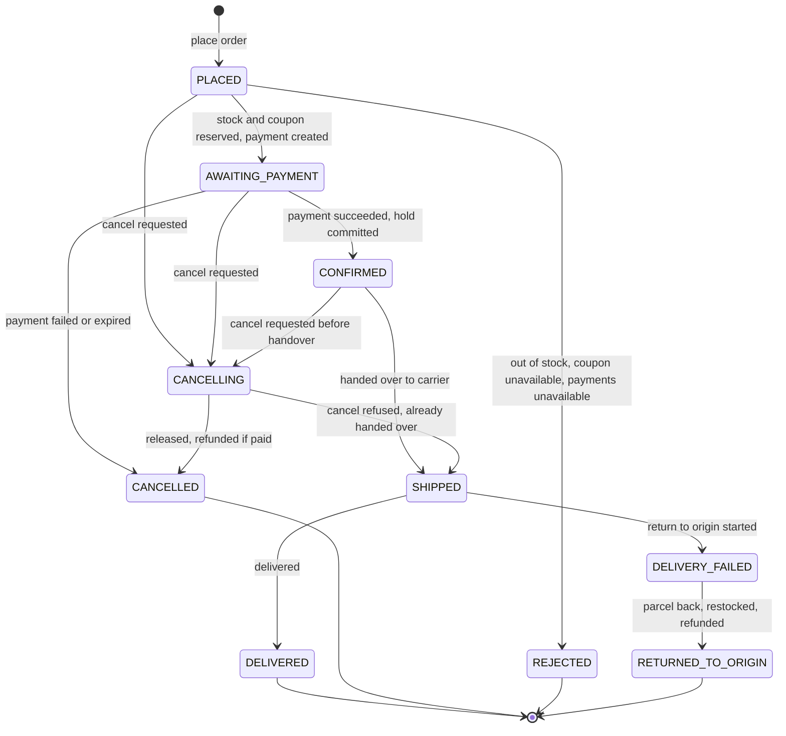
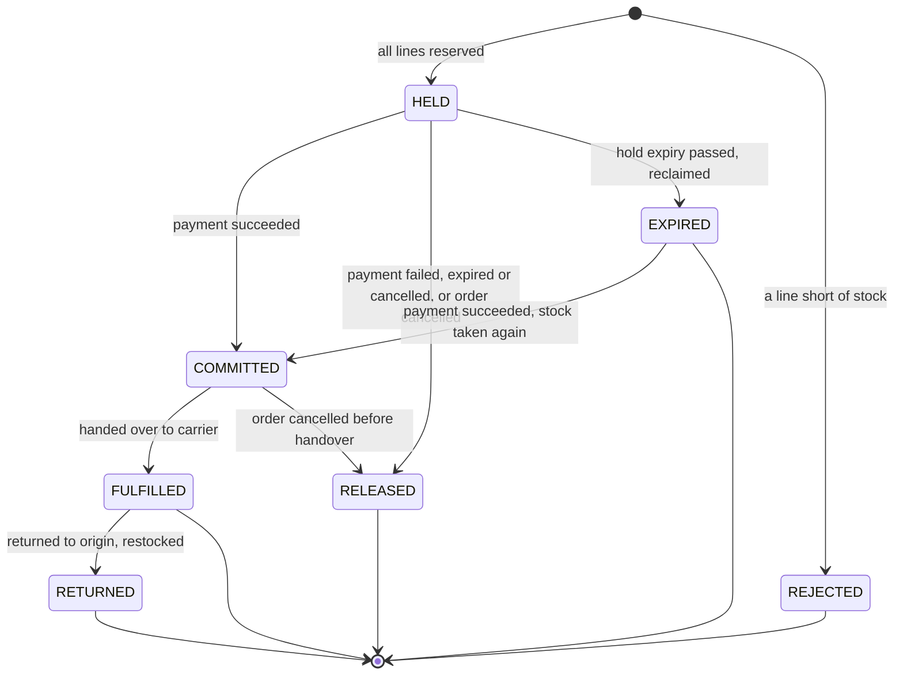
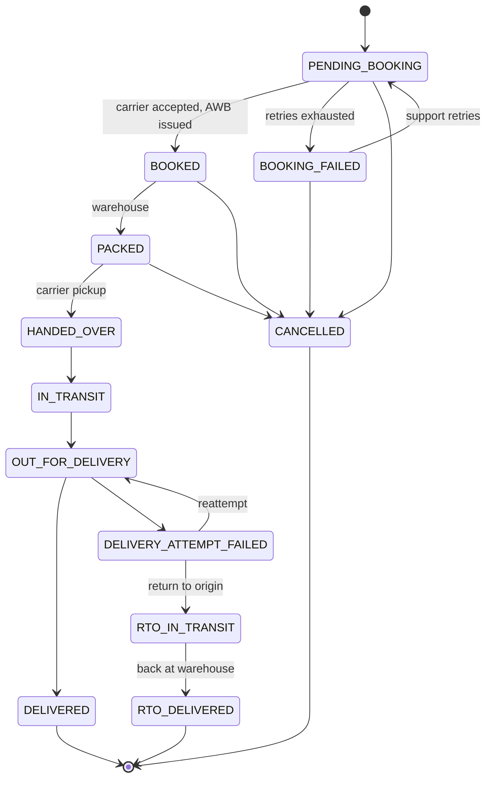

# Order lifecycle

| | |
|---|---|
| Phase | 2 — Domain modeling |
| Status | Approved 2026-10-02 |
| Related | [Domain model](domain-model.md) · [Architecture §13 (saga)](architecture.md#13-saga-architecture) · [ADR-007](decisions/ADR-007-saga-orchestration.md) · [Failure handling](failure-handling.md) |

## 1. Lifecycle at a glance

1. The customer asks for a quote: prices, GST, shipping fee and coupon, valid for 10 minutes.
2. The customer places an order from the quote and gets `202 Accepted`. The order is `PLACED`.
3. Stock is reserved for every line, then the coupon, if any.
4. A gateway payment and a hosted-checkout session are created. The order is `AWAITING_PAYMENT`.
5. The customer pays on the gateway's page. A webhook or a status poll reports success, the hold is committed, and the order is `CONFIRMED`. Payment success is the pivot.
6. A shipment is booked with the carrier, packed, and handed over. The order is `SHIPPED`.
7. The carrier reports delivery. The order is `DELIVERED`.

Before the pivot, a failed step is undone. After it, steps are retried; only the customer or support can cancel, and that starts a new branch of the process rather than an automatic rollback.

## 2. Order state machine

| From | To | Trigger | Decided by | Side effects |
|---|---|---|---|---|
| — | PLACED | `POST /v1/orders` with a valid quote and an `Idempotency-Key` | Customer or guest | OrderProcess started; ReserveStock |
| PLACED | AWAITING_PAYMENT | StockReserved, then CouponReserved (if any), then PaymentCreated | Saga | Checkout URL available on the order |
| PLACED | REJECTED | StockReservationFailed, CouponUnavailable or PaymentCreationFailed | Saga | Release whatever was reserved |
| PLACED | CANCELLING | CancelOrder | Customer, support | Applied when the current step completes: everything held so far is released |
| AWAITING_PAYMENT | CONFIRMED | PaymentSucceeded, then ReservationCommitted and the coupon committed | Saga | CreateShipment |
| AWAITING_PAYMENT | CANCELLED | PaymentFailed or PaymentExpired; or the hold was lost after payment and its stock could not be taken again | Saga | Release coupon and stock; refund in the lost-hold case |
| AWAITING_PAYMENT | CANCELLING | CancelOrder | Customer, support | CancelPayment |
| CONFIRMED | CANCELLING | CancelOrder before handover | Customer, support | CancelShipment |
| CANCELLING | CANCELLED | Payment cancelled, failed or expired; or the refund was requested | Saga | Release coupon and stock; refund if money was taken |
| CANCELLING | SHIPPED | ShipmentCancelRefused: already handed over | Saga | Cancellation refused; the customer is told |
| CONFIRMED | SHIPPED | ShipmentHandedOver | Saga | FulfillReservation |
| SHIPPED | DELIVERED | ShipmentDelivered | Saga | The process completes |
| SHIPPED | DELIVERY_FAILED | ShipmentReturnInitiated | Saga | — |
| DELIVERY_FAILED | RETURNED_TO_ORIGIN | ShipmentReturnedToOrigin | Saga | RestockReturn, RefundPayment |

**Reasons.** `REJECTED`: `OUT_OF_STOCK`, `COUPON_UNAVAILABLE`, `PAYMENTS_UNAVAILABLE`. `CANCELLED`: `CUSTOMER`, `SUPPORT`, `PAYMENT_FAILED`, `PAYMENT_EXPIRED`, `STOCK_LOST_AFTER_PAYMENT`.

**Refunds and the order status.** An order becomes `CANCELLED` or `RETURNED_TO_ORIGIN` in the transaction that requests its refund; the outbox guarantees the request is delivered ([LLD §6.4](low-level-design.md#64-orders)). The refund's progress lives on the payment record, and the order shows it; a failed refund raises an alert and a support task ([failure-handling S18](failure-handling.md#s18-a-refund-fails)).

**What customers see** is the order status plus details composed at read time: payment status, refund status and shipment tracking. The order does not copy those states; it references the records that own them.

## 3. Invalid transitions

Anything not in the table is rejected with `409 order_invalid_state`. For example:

- Any move back to an earlier status, such as `CONFIRMED` → `AWAITING_PAYMENT`.
- `PLACED` → `CONFIRMED`: payment cannot be skipped.
- `SHIPPED` → `CANCELLING`: once handed over, only a return (V2) can undo the sale.
- Any change from `DELIVERED`, `CANCELLED`, `REJECTED` or `RETURNED_TO_ORIGIN`.

## 4. Related state machines

### Reservation (Inventory)

`CommitReservation` on an `EXPIRED` reservation takes its stock again, all lines or none. Only if it cannot does it answer `ReservationLost`, and the saga refunds ([ADR-009 amendment](decisions/ADR-009-inventory-reservation.md#amendment-2026-10-03-phase-5-lld)).

### Payment record (Payments)

It mirrors the gateway's payment states (`requires_payment_method`, `processing`, `requires_action`, `succeeded`, `failed`, `cancelled`, `expired`) and only moves to a newer gateway `version`. The gateway's state machine is the authority (its LLD §3.1). `succeeded`, `failed`, `expired` and `cancelled` become PaymentSucceeded, PaymentFailed, PaymentExpired and PaymentCancelled. A failed attempt (`payment.attempt_failed`) does not end the payment: the customer can try again on the hosted page until it expires.

### Shipment (Fulfillment)

A tracking update is applied only if it is a valid transition from the current status **and** its carrier timestamp is newer than the last applied one. Otherwise it is kept in the history and ignored. A rank alone would not work: a reattempt legitimately goes back to `OUT_FOR_DELIVERY`.

## 5. Races and how they resolve

| Race | Resolution |
|---|---|
| Cancel vs. payment success | Both are transitions on the same Order, under an optimistic lock: whichever commits first wins and the other re-reads. If the cancel wins, the success arrives in `CANCELLING` and is refunded. If the success wins, the cancel arrives in `CONFIRMED`: the shipment is cancelled, the hold released and the payment refunded. Either way the order ends `CANCELLED` and the money is returned |
| Cancel vs. handover | The Shipment decides atomically: `CancelShipment` succeeds only before `HANDED_OVER`. If the warehouse wins, the order moves to `SHIPPED` and the cancellation is refused |
| Payment success vs. hold expiry | A hold outlives the gateway's ability to report success (payment window + 30-minute gateway grace + margin) and is released early on the gateway's terminal events. A success can only find its hold gone if webhooks were lost for the whole hold and another order reclaimed the stock in the minute before the deadline sweep; then `CommitReservation` takes the stock again if it can, and the saga refunds only if it cannot ([ADR-009](decisions/ADR-009-inventory-reservation.md)) |
| Duplicate or reordered gateway webhooks | Inbox keyed by gateway event id; a payment record changes only for a newer resource `version` |
| Two cancel requests | `Idempotency-Key`; a second request with another key finds `CANCELLING` or `CANCELLED` and gets that status back |
| Two refund requests | One refund per order and reason, with a gateway `Idempotency-Key` derived from both |
| Tracking updates out of order | The shipment rule in §4 |

## 6. Persistence and recovery

- Each transition is one local transaction. It updates Order and OrderProcess, writes the commands and events it causes to the outbox, and records the incoming message as processed. A crash before commit loses nothing, because the message is redelivered. A crash after commit loses nothing, because the outbox is relayed.
- Every waiting status has a deadline on OrderProcess. A recurring sweep on the Job Scheduler, every minute, resolves overdue orders ([ADR-003 amendment](decisions/ADR-003-job-scheduler-integration.md#amendment-2026-10-02-from-the-hld)).

| Status | Waiting for | Deadline | On deadline |
|---|---|---|---|
| PLACED | Reservation and payment creation | 2 min | Re-send the outstanding command; alert after 3 tries |
| AWAITING_PAYMENT | Payment outcome | Hold expiry: payment window (15 min, 5 for flash-sale SKUs) + gateway grace (30 min) + margin (5 min) | Poll the gateway and apply the result |
| CANCELLING | Gateway or shipment answer | 10 min | Poll or re-send; alert after 3 tries |
| CONFIRMED | Booking and handover | 24 h | Alert support |
| SHIPPED | Delivery | 14 days | Alert support: possible lost parcel |
| DELIVERY_FAILED | Parcel back at the warehouse | 21 days | Alert support |
