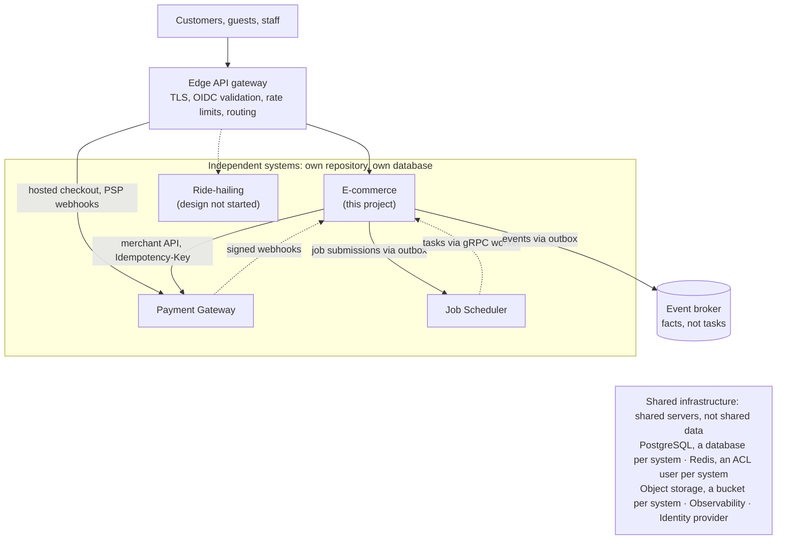

# Requirements — E-Commerce Order Platform V1

| | |
|---|---|
| Phase | 1 — Requirements discovery |
| Status | Approved 2026-10-02: all Phase 1 defaults accepted. Scope: this repository builds only the e-commerce system, one of four systems in the ecosystem (§2) |
| Next | [Domain model](domain-model.md) → [architecture](architecture.md) (HLD) → architecture approval → [implementation plan](implementation-plan.md) |

Rows marked **Assumed** were accepted as defaults on 2026-10-02 without separate discussion; they stay open to challenge. Items marked **Ecosystem** follow from the four-system architecture in §2.

---

## 1. Product summary

The order-management backend of one direct-to-consumer brand selling physical goods in India: catalog, cart, checkout, orders, inventory reservation, payment through the ecosystem's Payment Gateway, fulfillment through carriers, and customer notifications.

Its purpose is to demonstrate **business workflows across parties that fail independently**: a saga with compensation, inventory under contention (including a flash sale), event-driven integration over a broker, and eventual consistency that customers can see. Patterns the sibling projects already demonstrate (transactional outbox, idempotency keys, explicit state machines, signed webhooks, SLO alerting, Terraform) are reused, not re-derived.

V1 is a reference implementation on simulated carriers and the gateway's mock PSPs (no real money), engineered to production standards.

## 2. Ecosystem context

This system is one of four independent systems that share infrastructure and integrate through published contracts ([ADR-001](decisions/ADR-001-ecosystem-boundaries.md)). It is the first of the four to integrate with two of the others.

**Scope of this repository:** the e-commerce system only. The Payment Gateway and Job Scheduler are used unchanged, through their existing contracts. Ride-hailing is a separate project.

| System | Teaches | Status | What this system uses from it |
|---|---|---|---|
| Distributed Job Scheduler (Go) | Coordination: queues, workers, retries, scheduling | Built (phases 1–4, 6–9, 11) | Deadlines, retried calls to other parties, recurring jobs ([ADR-003](decisions/ADR-003-job-scheduler-integration.md)) |
| E-commerce (this project) | Business workflows: events, saga, inventory, consistency | Phase 1 | — |
| Payment Gateway (Java/Spring Boot) | Financial correctness: idempotency, reconciliation, webhooks | Built (phases 1–9, 13, 14) | This system is a merchant: payments, hosted checkout, refunds, signed webhooks ([ADR-002](decisions/ADR-002-payment-gateway-integration.md)) |
| Ride-hailing | Real time: geo, location, dispatch, concurrency | Repository set up; design not started | Nothing. Expected to become the gateway's second merchant and the scheduler's second tenant |

Ecosystem rules this system follows:

- **E1** Each system has its own repository, database, deployment and release cycle. No system reads another system's database. *(Ecosystem)*
- **E2** Systems integrate only through published contracts: REST APIs with OpenAPI, signed webhooks, broker events with versioned schemas, and the scheduler's job API. *(Ecosystem)*
- **E3** Shared infrastructure means shared servers, not shared data: a database and role per system on one PostgreSQL server locally; separate instances in the cloud where blast radius matters. *(Proposed)*
- **E4** The broker carries facts (events); the scheduler carries tasks (do X at time T, with retries). *(Proposed)*
- **E5** One edge API gateway for external traffic. It authenticates end users and applies coarse rate limits; each system still authorizes every request. Calls between systems stay on the internal network, with each system's own credentials. The exception is the gateway's webhooks: outside local runs its SSRF guard only delivers to public HTTPS addresses, so they arrive through the edge. *(Proposed)*
- **E6** One observability stack. An order is traceable across e-commerce, gateway and scheduler by trace context and business ids (the gateway's `merchant_order_id` is the order id). *(Ecosystem)*
- **E7** No change to a sibling project is required. A shared platform repository (edge configuration, identity-provider realm, broker ACLs, one observability stack, a compose file for all systems) is deferred until a second system needs it. Until then, this repository's compose file runs what this system needs, and an optional profile runs the real gateway and scheduler. *(Proposed)*

## 3. Scope decisions (from Phase 1)

| # | Topic | Decision | Source |
|---|---|---|---|
| Q1 | Learning focus | Go deep on the saga with compensation, inventory contention, broker semantics, service extraction and cross-system integration. Reuse what the sibling projects already demonstrate | Ecosystem brief |
| Q2 | Market | One brand, B2C, physical goods, India, INR only | Ecosystem (the gateway is INR-only) + Assumed |
| Q3 | V1 scope | **V1:** whole-order cancellation until handover to the carrier; GST per line; one coupon type with a redemption limit. **V2:** returns with partial refunds, partial shipments, cash on delivery. **Later:** promotions engine, exchanges, gift cards. **Never:** subscriptions | Assumed |
| Q4 | Identity | Customer accounts and guest checkout (guests reach their order through a signed link); OIDC through the ecosystem identity provider; roles customer, support, warehouse, admin; no saved payment methods | Assumed |
| Q5 | Catalog | Thin: products with variants (one SKU per combination of option values); admin API; about 10,000 SKUs; PostgreSQL search; no search engine | Assumed |
| Q6 | Cart | Server-side carts for customers and guests, merged at sign-in; expire after 30 days (guest) or 90 days (customer) without activity; no reservation at add-to-cart; re-priced at checkout | Assumed |
| Q7 | Order | Confirmed = stock reserved and payment succeeded. Customers can cancel until handover to the carrier. Placing an order answers `202 Accepted` with a status to follow | Assumed |
| Q8 | Inventory | One warehouse, with the location in the inventory key. This system is the source of truth for sellable stock. Reservation at placement, expiring with the payment window. No backorders or pre-orders | Assumed |
| Q9 | Payment | The ecosystem's Payment Gateway, through its merchant API, hosted checkout, signed webhooks and status polling. Automatic capture. Prepaid only in V1 (UPI, cards, netbanking); cash on delivery in V2, outside the gateway | Ecosystem diagram + Assumed details |
| Q10 | Shipping | Hand-off to carriers through an adapter. The V1 carrier is simulated with scripted failures: outage, unserviceable PIN code, late or out-of-order tracking, failed delivery and return to origin. Warehouse work is limited to "packed" and "handed over" | Assumed |
| Q11 | Scale | NFR-1 and NFR-2 | Assumed |
| Q12 | Reliability | NFR-4 to NFR-8 | Assumed |
| Q13 | Security | No card data ever (the gateway's hosted checkout); §7 | Assumed |
| Q14 | Deployment | AWS Mumbai (ap-south-1), alongside the gateway; container runtime decided at Technology Selection; environments created on demand and destroyed. Terraform is tested without an AWS account; applying it to a real account is a separate step with a cost estimate ([ADR-014](decisions/ADR-014-deployment.md)) | Assumed |
| Q15 | Extensibility | The V1 model must not preclude returns with partial refunds, multiple warehouses with split shipments, or marketplace sellers | Assumed |
| Q16 | Surfaces | REST API with OpenAPI, plus demo scripts. Customers pay on the gateway's hosted checkout. No storefront UI | Assumed |

**Delivery progression, adjusted for the ecosystem.** The broker, gateway and scheduler exist from day one, so V1 already has real cross-system boundaries:

1. **V1:** modular monolith on its own database. Real integrations with the gateway and scheduler; integration events published to the broker through the outbox; the checkout saga runs in-process.
2. **V2:** modules interact only through commands and events, and no transaction spans two modules, so extraction becomes mechanical.
3. **V3:** extract services where a driver exists, starting with Inventory (it scales differently in a flash sale).
4. **V4:** the saga runs across the extracted services over the broker.
5. **V5:** horizontal scaling, failure injection and flash-sale load tests.
6. **V6:** production deployment on AWS.

## 4. Actors

| Actor | Interacts through |
|---|---|
| Customer (signed in) | Edge API gateway with an OIDC token |
| Guest | Edge API gateway; signed order link |
| Support agent | Staff API: cancel, refund, resolve stuck orders |
| Warehouse operator | Staff API: stock receipts and adjustments, packed, handed over |
| Admin | Staff API: catalog, prices, coupons, configuration |
| Payment Gateway | Merchant API (called by this system); signed webhooks (sent to this system) |
| Carrier | Carrier API (called through an adapter); tracking webhooks |
| Job Scheduler | Job API (called by this system); task execution (calls this system) |

## 5. Functional requirements

### 5.1 Catalog

- **FR-CAT1** Admins manage products, variants, attributes, categories and media. Each variant is a SKU defined by option values such as size and color.
- **FR-CAT2** Each SKU has a list price in INR and a GST category.
- **FR-CAT3** Customers browse by category and search by text. Results may lag catalog changes by seconds.
- **FR-CAT4** Product pages show an availability hint (in stock, low, out of stock) that may be stale. Only checkout is authoritative.
- **FR-CAT5** Images are stored in object storage and uploaded through pre-signed URLs.

### 5.2 Customers and identity

- **FR-CUS1** Customers sign in through the ecosystem identity provider. This system stores profiles and addresses (with PIN code and state).
- **FR-CUS2** Guests check out with email and phone, and reach their order through a signed, expiring link.
- **FR-CUS3** A customer can read only their own carts and orders. Order ids must not be guessable.

### 5.3 Cart

- **FR-CRT1** Add, remove and change the quantity of items; apply or remove one coupon.
- **FR-CRT2** A guest cart merges into the customer's cart at sign-in.
- **FR-CRT3** Carts expire after inactivity (Q6) and never hold stock.

### 5.4 Checkout and pricing

- **FR-CHK1** Checkout produces a **quote**: current unit prices, discount allocated to lines, GST per line (CGST + SGST when the warehouse and delivery address are in the same state, IGST otherwise), shipping fee and total, valid for a few minutes. Price changes since items were added are shown.
- **FR-CHK2** Placing an order requires a valid quote and an `Idempotency-Key`. A retried placement returns the same order.
- **FR-CHK3** Placing an order answers `202 Accepted` with the order id. The client follows the order's status and is sent to the gateway's hosted checkout to pay.
- **FR-CHK4** A coupon with a redemption limit is reserved at placement and released if the order fails, under the same rules as stock.
- **FR-CHK5** Amounts are integer paise. Rounding rules for tax and discount allocation are documented and tested.

### 5.5 Orders

- **FR-ORD1** An order keeps immutable snapshots of what was bought: product and variant details, unit price, discount, tax breakdown, shipping fee, addresses and currency.
- **FR-ORD2** The order lifecycle is a formal state machine (designed in domain modeling). Invalid transitions are rejected.
- **FR-ORD3** Every order reaches a terminal state. Each wait on another party has a deadline and a recovery path.
- **FR-ORD4** A customer can cancel until the parcel is handed to the carrier. A cancellation requested while a payment attempt is in flight completes when the payment resolves, with a refund if it succeeded.
- **FR-ORD5** Support can cancel and refund with a reason code. Every staff action is audit-logged with the actor.
- **FR-ORD6** The customer sees the order's status and the reason for any failure (out of stock, payment failed or expired, cancelled).

### 5.6 Inventory

- **FR-INV1** Stock is kept per SKU and location. The exact model (on hand, reserved, committed) is settled in domain modeling.
- **FR-INV2** Placement reserves every line of an order, or none of them.
- **FR-INV3** A reservation is committed on payment success and released on payment failure, expiry or cancellation. Stock leaves at handover to the carrier.
- **FR-INV4** **No overselling**, under any concurrency, including the flash sale.
- **FR-INV5** An expired reservation never blocks another order, even if the cleanup task runs late.
- **FR-INV6** Reservation expiry accounts for the gateway's grace for payments still processing (30 minutes by default): either the stock stays held until the payment is terminal, or a success that arrives after release is refunded. The choice is made in saga design.
- **FR-INV7** Warehouse operators record receipts and adjustments with a reason; each change is audit-logged.

### 5.7 Payments through the Payment Gateway

- **FR-PAY1** Each order has one gateway payment: `merchant_order_id` is the order id, capture is automatic, and its expiry is aligned with the reservation (FR-INV6).
- **FR-PAY2** Failed attempts can be retried on the hosted checkout until the payment expires. The order fails only when the payment fails or expires.
- **FR-PAY3** Outcomes arrive through signed webhooks: the signature is verified, events are deduplicated by event id, and stale updates are ignored by resource version. A payment with no outcome by its deadline is resolved by polling the gateway.
- **FR-PAY4** Cancelling a paid order refunds it in full through the gateway. Partial refunds come with returns in V2.
- **FR-PAY5** A payment that succeeds after its order was cancelled is refunded automatically (the gateway's `AUTO_REFUND` late-success policy), and the refund is recorded on the order.
- **FR-PAY6** A scheduled reconciliation checks that every paid order has a succeeded payment, and that no order waits on a payment past its deadline.

### 5.8 Fulfillment

- **FR-FUL1** A confirmed order gets a shipment, booked with a carrier through an adapter.
- **FR-FUL2** Warehouse operators mark shipments packed and handed over. Carrier tracking updates the shipment: in transit, out for delivery, delivered, failed attempt, return to origin.
- **FR-FUL3** Tracking updates can arrive late, duplicated or out of order. A shipment's status never moves backwards.
- **FR-FUL4** A carrier outage delays a paid order but never cancels it automatically. Booking is retried, then escalated to support.
- **FR-FUL5** A parcel returned to origin is restocked and the customer refunded.

### 5.9 Notifications

- **FR-NOT1** Customers are notified of placement, confirmation, payment failure or expiry, cancellation, shipment, delivery and refund. V1 delivers to a local mail catcher.
- **FR-NOT2** A notification is sent at most once per order and event type, even when its trigger is delivered twice.

### 5.10 Events and background work

- **FR-EVT1** Integration events are published to the shared broker through a transactional outbox: no event without its state change, and no state change without its event.
- **FR-EVT2** Every event carries a unique id, type and version, aggregate id and sequence, correlation id and trace context. Every consumer is idempotent.
- **FR-EVT3** Event schemas are versioned and checked for compatibility. Consumers ignore unknown fields.
- **FR-EVT4** Deadlines, retried external calls and recurring jobs run on the Job Scheduler. Submission goes through the outbox, and task handlers are idempotent on the job id.

## 6. Non-functional requirements

| # | Requirement | Target |
|---|---|---|
| NFR-1 | Throughput (Assumed) | 2 orders/s on average, 200 orders/s at peak; 5,000 catalog reads/s at peak |
| NFR-2 | Flash sale (brief) | 100,000 users within 60 s for one SKU with 1,000 units: zero overselling; every request answered with accepted, queued or sold out, never a timeout; other products unaffected |
| NFR-3 | Latency (Assumed) | p99 excluding the gateway and carriers: order placement ≤ 300 ms; status and catalog reads ≤ 100 ms |
| NFR-4 | Availability (Assumed) | 99.9% a month for checkout. Browsing does not depend on checkout's dependencies |
| NFR-5 | Durability (Assumed) | RPO 0 for orders, reservations, payments and the outbox. RTO ≤ 15 min for an availability-zone failure; region loss handled by a restore runbook |
| NFR-6 | Consistency | Strong per SKU (reservations) and per order. Eventual for search, availability hints, notifications and analytics. The consistency matrix is written in consistency and failure analysis |
| NFR-7 | Recovery | No order stays non-terminal past its deadline without an alert. Every asynchronous step has a timeout and an owner |
| NFR-8 | Dependency failure | A broker outage never blocks order placement (the outbox buffers). A scheduler outage delays cleanup and notifications, never an invariant. A gateway outage stops new prepaid orders with a clear error |
| NFR-9 | Observability | An order is traceable end to end across all three systems. Metrics from brief §38. No personal or payment data in logs |
| NFR-10 | Local development | `docker compose up` runs this system alone, with fakes for the gateway and scheduler. An optional profile runs the real gateway and scheduler alongside it |
| NFR-11 | Cost | Cloud environments are created on demand and destroyed. An always-on managed service needs an ADR that justifies its cost |

## 7. Security and compliance constraints

- **Card data (PCI DSS):** never touches this system. Customers pay on the gateway's hosted checkout, which keeps the merchant's scope SAQ A-eligible.
- **Authentication:** OIDC tokens are validated at the edge and again in the service. Staff roles are enforced in the service.
- **Object-level authorization:** every access to an order, cart or address is checked against its owner.
- **Webhooks:** gateway webhooks are verified by HMAC signature and timestamp; carrier webhooks by the carrier's scheme. The edge does not apply end-user authentication to them.
- **Secrets:** the merchant API key, webhook secrets and scheduler credentials come from a secrets manager and are never logged.
- **Personal data (India's DPDP Act):** collect only what fulfillment needs; on account deletion, anonymize personal data and keep the order and tax records the law requires.
- **GST:** the tax breakdown is recorded per line. Tax invoices are V2 (Assumed).
- **Abuse:** per-client rate limits at the edge; checkout admission control in this system for flash sales.

## 8. Out of scope for V1

Marketplace sellers, multiple warehouses, cash on delivery, returns and exchanges (other than return to origin), partial cancellation, gift cards, subscriptions, a promotions engine, multiple currencies, international shipping, a storefront UI, recommendations, a search engine, and fraud scoring beyond the gateway's risk engine.

## 9. Open items

### 9.1 Assumptions

None open. The defaults (rows marked Assumed in §3, and NFR-1, NFR-3, NFR-4 and NFR-5) were accepted on 2026-10-02.

### 9.2 Sibling projects (nothing blocking)

| # | Item | Effect on this project |
|---|---|---|
| X1 | The scheduler runs jobs only on gRPC workers, with a Go SDK only | This system implements the worker protocol in Java ([ADR-003](decisions/ADR-003-job-scheduler-integration.md)). An HTTP executor, on the scheduler's roadmap, would make that worker unnecessary |
| X2 | Scheduler workers share one token until its phase 12 adds per-pool credentials | This system runs in its own pool; isolation rests on configuration until then |
| X3 | The gateway has no merchant API that lists payments by time window | Reconciliation checks the payment ids this system stores. That is enough because payment creation is idempotent and retried until it succeeds |
| X4 | Both sibling `docker compose` files bind host ports 5432 and 8080, and their observability stacks both use 3000 and 9090 | The optional compose profile gives the gateway and scheduler their own host ports; their repositories stay unchanged |
| X5 | Broker product (Kafka or RabbitMQ), edge gateway product and container runtime | Chosen at this project's Technology Selection, and reused if a platform repository is created |

## 10. Glossary

| Term | Meaning |
|---|---|
| SKU | A sellable variant, such as "T-shirt, red, M" |
| Quote | The priced checkout result an order is placed against |
| Reservation | Stock held for an order until its payment succeeds, fails or expires |
| Pivot | The saga step after which the workflow only moves forward (here, payment success) |
| Place of supply | GST rule: same state → CGST + SGST; different states → IGST |
| RTO | Return to origin: an undeliverable parcel coming back to the warehouse |
| AWB | Air waybill: the carrier's tracking number |
| Outbox | A table written in the same transaction as a state change and relayed to the broker or scheduler afterwards |
